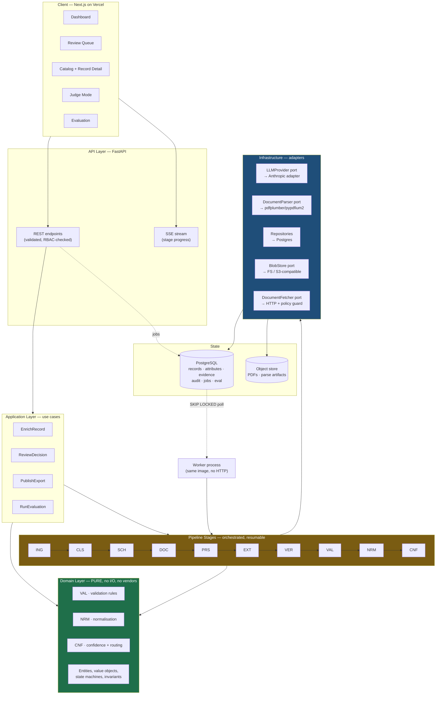
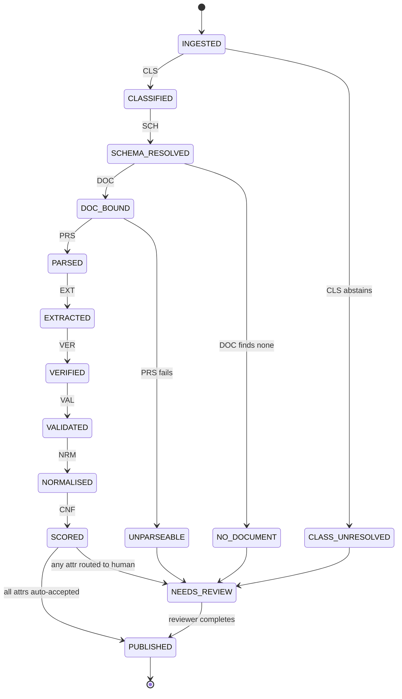
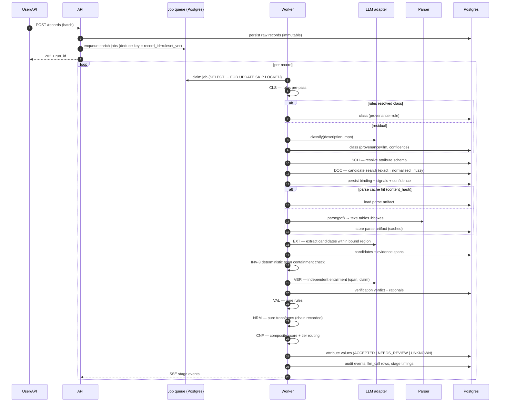
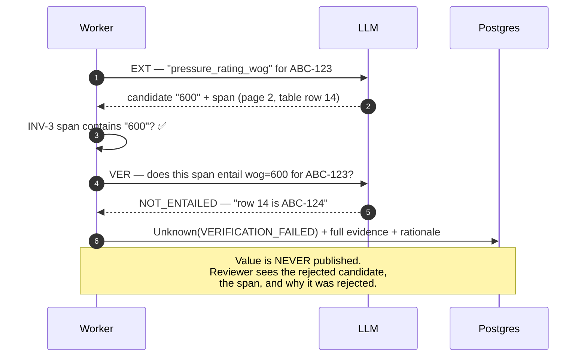
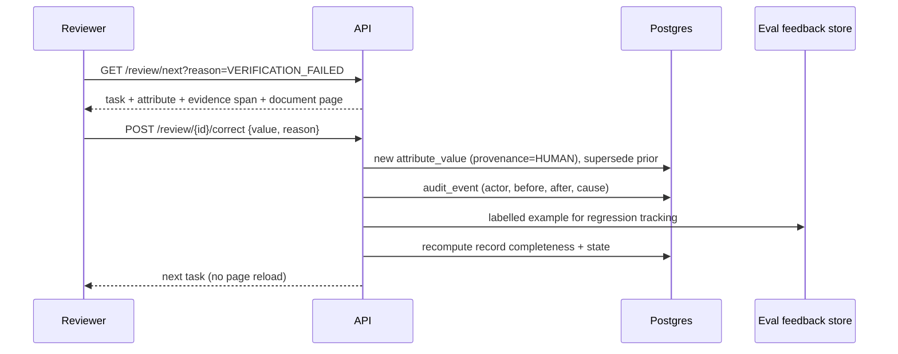
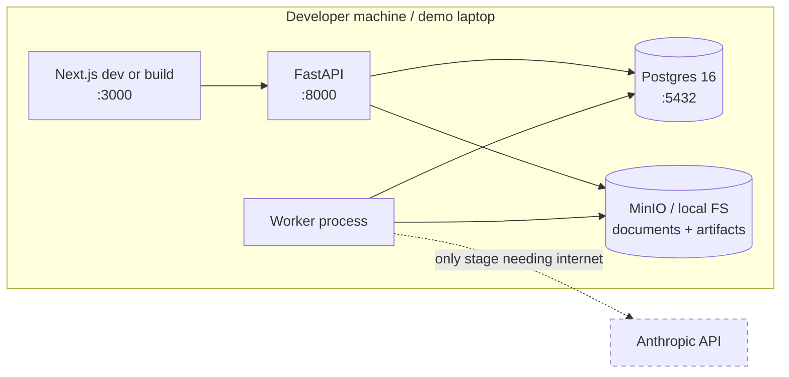

# Phase 3 — System Architecture

> **Audience:** all engineers. **Read before writing any code.**
> **Governing principle:** the deterministic core must be provably free of AI. Everything AI touches
> is an adapter at the edge, replaceable without touching the domain.

---

## 1. Architectural style — and why

### ADR summary: Modular monolith, ports & adapters, staged persistent pipeline

**Decision:** a single deployable backend service composed of strictly-bounded modules, plus a
separate worker process running the same codebase. Not microservices.

**Why:**

| Force | Consequence |
|---|---|
| 3 developers, 4 weeks | Microservice overhead (network contracts, distributed tracing, N deploy pipelines, local orchestration) would consume ~25% of the budget and buy nothing |
| Requirement NFR-MNT-2 (every module independently replaceable) | Satisfied by **interfaces**, not by process boundaries. Replaceability is a *coupling* property, not a *deployment* property |
| Requirement INV-6 (deterministic purity) | Enforced by an import-graph test — trivial inside one codebase, awkward across services |
| Future scaling | Modules have explicit ports; extracting `PRS` or `EXT` into its own service later is a deploy change, not a rewrite |
| Demo reliability (NFR-AVL-2) | One `docker compose up` starts everything. Fewer moving parts = fewer demo failures |

**Rejected alternatives:** microservices (premature, costly), serverless-function-per-stage
(cold starts, hard local dev, awkward long-running parse), single-file script (untestable, no boundaries).

> **The senior-engineer framing for judges:** "We built a modular monolith with enforced boundaries.
> The module graph is a microservice architecture that hasn't paid the distribution tax yet."

---

## 2. Component architecture



### Dependency rule (enforced by test, not convention)

```
api  →  application  →  domain
             ↓
       infrastructure  →  domain
```

- `domain/` imports **nothing** outside the standard library + `pydantic`.
- `domain/val/` and `domain/nrm/` additionally import **no** clock, no RNG, no network. (INV-6)
- `infrastructure/` may import `domain` (to implement its ports). Never the reverse.
- A CI test walks the import graph and fails the build on violation. See `09-testing.md`.

---

## 3. Service boundaries & module contracts

| Module | Owns | Port (interface) it exposes | May be replaced by |
|---|---|---|---|
| `ING` | Raw record intake, MPN canonicalisation | `RecordIngestor` | ERP connector |
| `CLS` | Class assignment + abstention | `Classifier` | Fine-tuned model, rules-only |
| `SCH` | Attribute schema resolution | `SchemaResolver` | ETIM service, PIM schema import |
| `DOC` | Corpus, candidate search, MPN↔doc↔row binding | `DocumentBinder` | Vector search, supplier feed |
| `PRS` | Text/table/bbox extraction, caching | `DocumentParser` | Any parser (see ADR-0005) |
| `EXT` | Grounded candidate extraction | `Extractor` | Any LLM provider or local model |
| `VER` | Independent entailment verification | `Verifier` | Different model, NLI model, human |
| `VAL` | Deterministic validation | *(pure functions)* | — (domain, not adapter) |
| `NRM` | Deterministic normalisation | *(pure functions)* | — (domain, not adapter) |
| `CNF` | Composite confidence + tier routing | *(pure functions)* | Learned scorer (same interface) |
| `PRV` | Provenance + audit persistence | `ProvenanceStore` | Event store |
| `RVW` | Review tasks, human decisions | `ReviewService` | — |
| `PUB` | Export adapters | `ExportTarget` | CX1, CSV, JSON, API pull |
| `EVL` | Gold set scoring, calibration | `Evaluator` | — |

**Contract rule:** a module may only be called through its port. Cross-module imports of internal
symbols are a build failure. This is what makes Principle #8 real rather than aspirational.

---

## 4. The pipeline as a persistent state machine

The single most important architectural decision after layering.

**Every record has a `pipeline_state`. Every stage transition is persisted before the next stage
begins.** Stages are individually resumable, individually retryable, and individually cacheable.



**Why persistent rather than in-memory:**

| Benefit | Detail |
|---|---|
| Resumability (NFR-REL-1) | Worker crash loses ≤1 stage of work |
| Partial degradation (NFR-REL-3) | A stage failure produces `Unknown(reason)` for affected attributes; the record continues |
| Caching (NFR-SCL-4) | `PRS` output keyed by document content hash — parse cost paid once per document, not per SKU |
| Observability | Per-stage latency, cost, and failure rate fall out for free |
| Demo narration (NFR-PERF-11) | Each transition emits an SSE event; the UI narrates the pipeline live |
| Debuggability | Any record can be replayed from any stage against a new prompt/ruleset version |

> ⚠ **Trap avoided:** the naive design is one big `enrich(record)` function that does everything in
> memory and returns a result. It is faster to write and catastrophic to operate — no resumption,
> no caching, no partial results, no progress, and every retry re-pays the whole LLM cost.

---

## 5. Sequence diagrams

### 5.1 Happy path — record enrichment



### 5.2 Abstention path — the differentiator



### 5.3 Review → republish



---

## 6. State management

| State | Home | Rationale |
|---|---|---|
| Catalog records, attributes, evidence, audit | PostgreSQL | Relational integrity, transactional invariants, one dependency |
| Documents (PDFs) | Object store | Large binaries don't belong in a row |
| Parse artifacts (text/tables/bboxes) | Object store, indexed by `content_hash` in PG | Regenerable, large, cacheable |
| Job queue | PostgreSQL (`SELECT … FOR UPDATE SKIP LOCKED`) | **See ADR-0004.** No Redis/Celery in the MVP |
| Config (thresholds, routing, policies) | PostgreSQL, hot-reloadable | FR-ADM-4: change without redeploy |
| Schemas + validation rules | Versioned YAML in-repo, loaded at boot | FR-SCH-2: declarative data, reviewable in PRs |
| Prompts | Versioned files in-repo | NFR-MNT-7, INV-10 reproducibility |
| Frontend server state | TanStack Query | Cache + invalidation, no global store needed |
| Frontend client state | React state + URL params | Filters/sorting in the URL = shareable, back-button-correct |
| Sessions | HTTP-only cookie | Track B |

> **No Redis in the MVP.** Justified in ADR-0004. Caching needs are served by the parse-artifact
> store (content-hash keyed, durable) and HTTP cache headers. Adding Redis buys latency we don't
> need and costs an operational dependency we can't afford to debug at 2am in week 4.

---

## 7. Caching strategy

| Cache | Key | Invalidation | Saves |
|---|---|---|---|
| Parse artifacts | `document.content_hash` | Never (content-addressed) | The single largest cost — parsing a 40-page catalog once instead of per-SKU |
| LLM prompt cache | Provider-side, on the document-context prefix | Provider TTL | ~60–80% of input tokens when enriching many SKUs from one family document |
| Extraction results | `(record_id, attribute_id, prompt_ver, model_id, doc_content_hash)` | Version change | Re-runs after unrelated code changes are free |
| Classification rules | In-process, loaded at boot | Config version bump | Trivially |
| Dashboard aggregates | Materialised view, refreshed on run completion | Run completion | Sub-second dashboards at 100k records (NFR-PERF-9) |
| Frontend queries | TanStack Query, staleTime tuned per view | Mutation invalidation | Perceived speed in the review queue |

> 💡 **The family-document cache is a business argument, not just an optimisation.** A distributor
> enriching 300 SKUs from one Apollo catalog pays parse cost once and prompt-cached context 300
> times. Cost per SKU *falls* as catalog density rises — that is the sub-linear scaling claim in
> NFR-SCL-5, and it belongs on the margin slide.

---

## 8. Authentication & authorization

**MVP posture (Track B, deliberately minimal):**

- Cookie session auth, server-side session records, CSRF token on mutations.
- Four roles: `admin` · `approver` · `reviewer` · `viewer`.
- **Authorization is checked in the application layer**, never only in the UI. Every use case
  receives an `ActorContext` and asserts permission before touching a repository.
- Tenant ID is present on every table from day one, and every repository query is tenant-scoped
  through a single base class — so multi-tenancy is a *policy* change later, not a migration.

| Role | Read | Review Tier 1–3 | Approve Tier 0 | Publish | Configure |
|---|---|---|---|---|---|
| viewer | ✅ | | | | |
| reviewer | ✅ | ✅ | | | |
| approver | ✅ | ✅ | ✅ | ✅ | |
| admin | ✅ | ✅ | ✅ | ✅ | ✅ |

**Deferred (Track C):** SSO/SAML, SCIM, org management, API keys with scopes.

---

## 9. Background jobs & async workflow

**Design:** Postgres-backed queue, polled by N stateless worker processes.

```
jobs(id, tenant_id, type, payload, dedupe_key UNIQUE, state,
     attempts, next_attempt_at, locked_by, locked_at, created_at)
```

- **Claim:** `UPDATE jobs SET state='running', locked_by=… WHERE id IN (SELECT id FROM jobs WHERE
  state='queued' AND next_attempt_at <= now() ORDER BY created_at FOR UPDATE SKIP LOCKED LIMIT n)`
- **Idempotency (NFR-REL-2):** `dedupe_key = hash(record_id, stage, ruleset_ver, prompt_ver)`.
  Re-enqueueing an identical unit of work is a no-op.
- **Retry (NFR-REL-4):** exponential backoff with jitter, max 3 attempts, then `dead` with the
  error captured. Dead jobs surface on the ops dashboard, they don't disappear.
- **Heartbeat:** `locked_at` older than the lease is reclaimed — crashed workers self-heal.
- **Concurrency control:** per-provider semaphore so LLM rate limits are respected globally, not
  per-worker.

**Why not Celery/RQ/SQS:** ADR-0004. One dependency, transactional enqueue-with-write (the job and
the record are committed atomically — impossible with an external broker without an outbox), trivial
local dev, full SQL visibility into queue state. The port abstraction allows a swap if scale demands.

---

## 10. Error handling strategy

**Three error classes, three behaviours. No exceptions to this.**

| Class | Examples | Behaviour |
|---|---|---|
| **Expected/domain** | Attribute not in document; validation rule failed; binding below threshold | **Not an error.** Produces `Unknown(reason_code)` and the pipeline continues. This is the product working correctly. |
| **Transient/infrastructure** | LLM 429/503, network timeout, blob store hiccup | Retry with backoff (max 3). On exhaustion → `Unknown(SYSTEM_ERROR)` for affected attributes, record continues, job marked `dead`, alert raised. |
| **Programming/contract** | Invariant violated, schema mismatch, impossible state | **Fail loudly and immediately.** Crash the job, log with full context, never degrade silently. An INV violation must never be swallowed. |

**Rules:**
- Never catch bare `Exception` outside the worker's top-level boundary.
- Never let a stage failure fail an entire batch (NFR-REL-3).
- Every error carries a correlation ID linking API request → run → record → stage → LLM call.
- The user-facing surface for a failure is always a reason code from the closed taxonomy — never a
  stack trace, never a null.

---

## 11. Observability

| Signal | Implementation | Used for |
|---|---|---|
| **Structured logs** | JSON, `correlation_id`, `run_id`, `record_id`, `stage` | Debugging, audit |
| **Traces** | OpenTelemetry spans per pipeline stage and per LLM call | Latency attribution (NFR-PERF-*) |
| **Metrics** | Stage latency p50/p95, tokens, cost, error rate, abstention rate by reason, queue depth, throughput | Dashboard + NFR verification |
| **LLM call ledger** | First-class `llm_call` table: model, prompt version, tokens in/out, cost, latency, outcome, linked to record + stage | Cost attribution (NFR-CST-1), reproducibility (INV-10), and the cost slide |
| **Eval runs** | Stored, versioned, comparable across time | Quality trend (FR-DSH-4) |
| **Audit log** | Append-only `audit_event` | Compliance + INV-8 |

> **Build the `llm_call` ledger in M0, not M4.** It is simultaneously an observability tool, a cost
> control, a reproducibility mechanism, and a demo asset. Every team that adds cost tracking last
> discovers in week 4 that they cannot answer "what does this cost per SKU?" — which is the single
> question the business judge will ask.

---

## 12. Deployment topology

### 12.1 Local / demo (the primary target — NFR-AVL-2)



`docker compose up` → everything running with a seeded corpus and cached parse artifacts.
**The only external dependency is the LLM API, and cached-run mode removes even that.**

### 12.2 Cloud (bonus, not demo-critical)

| Component | Target | Why |
|---|---|---|
| Frontend | Vercel | Zero-config Next.js, preview deploys per PR, fast |
| Backend API + worker | Container host (Fly.io / Render / Railway) | Long-running worker needs a persistent process; 300s+ parse jobs |
| Database | Neon Postgres (Vercel Marketplace) | Managed, branchable per preview env |
| Object store | Vercel Blob (private) or S3-compatible | Private blob support; simple SDK |
| Secrets | Platform env / `vercel env` | NFR-SEC-5 |

> ⚠ **Do not make the cloud deployment the demo path.** Demo from local with a pre-warmed database.
> The cloud deploy exists to prove deployability and to give judges a link, not to carry the live demo.

---

## 13. Scaling strategy (future, documented not built)

| Scale point | Trigger | Change |
|---|---|---|
| Worker throughput | Queue depth sustained > 10k | Add worker replicas. Already stateless — a replica-count change. |
| Parse cost | Corpus > 50k documents | Extract `PRS` behind its port into a dedicated service/pool with more CPU |
| Document search | Corpus > 100k documents | Add pgvector or a search service behind `DocumentBinder` (OOS-12 today) |
| Database | > 10M attribute values | Partition `attribute_value` and `audit_event` by tenant + month; the schema already carries both keys |
| LLM cost | > 100k SKU/month | Route more traffic to smaller models via the confidence-gated escalation ladder (see `03-ai-pipeline.md` §7) |
| Multi-tenancy | 2nd customer | Flip tenant scoping from single-value to per-session. Already in every table and query. |
| Availability | Production SLA | Stateless services behind a load balancer, managed Postgres with replicas. **Topology change, not a rewrite.** |

---

## 14. Technology selections

| Layer | Choice | Primary justification | Rejected |
|---|---|---|---|
| Backend | **Python 3.12 + FastAPI** | Team strength; the PDF/ML ecosystem lives here; Pydantic gives typed structured-output contracts for free | Node (weaker PDF/ML), Go (no ecosystem for this) |
| Frontend | **Next.js 15 App Router + TS + React** | Team strength; the PDF-viewer + review-queue UX needs a real framework; Vercel deploy is free and instant | SPA + Vite (fine, but loses SSR + preview deploys) |
| UI kit | **Tailwind + shadcn/ui** | Copy-in components, no runtime lock-in, accessible primitives (Radix) satisfy NFR-ACC-1 cheaply | MUI (heavy, opinionated), hand-rolled (no time) |
| Database | **PostgreSQL 16** | JSONB for flexible attribute payloads + full relational integrity for invariants; queue; full-text search; pgvector available later. One dependency does five jobs | Mongo (no transactional invariants), SQLite (no concurrency) |
| ORM/migrations | **SQLAlchemy 2 + Alembic** | Mature, typed, explicit migrations | Raw SQL (no migration story), Prisma (JS-side) |
| PDF parsing | **pdfplumber + pypdfium2** | Bounding boxes + table structure; **permissive licences** — see ADR-0005 | PyMuPDF (AGPL — commercial risk) |
| LLM | **Anthropic Claude** via a `LLMProvider` port | Strong structured output + long context for family documents; router allows any provider | Direct single-vendor coupling |
| Jobs | **Postgres queue** | ADR-0004 | Celery+Redis, SQS |
| Tests | pytest, Vitest, Playwright | Standard | — |
| CI | GitHub Actions | Free, familiar | — |

---

## ✔ Summary

- **Modular monolith with enforced boundaries** — microservice-shaped module graph without the
  distribution tax; extraction to services later is a deploy change.
- **The pipeline is a persisted state machine**, not a function call. This buys resumability,
  caching, partial degradation, live progress narration, and replay — all requirements, all free.
- **Deterministic core is architecturally isolated** and its purity is enforced by an import-graph
  test that fails the build (INV-6). This is the difference between claiming and guaranteeing.
- **One database does five jobs** (records, provenance, queue, config, search), which is the correct
  trade at this scale and a defensible answer to "why no Redis/Kafka?"
- **Three-class error model**: expected → `Unknown` with a reason; transient → retry then degrade;
  contract violation → crash loudly. Silent degradation is never acceptable in a trust product.
- **Demo runs entirely locally.** Cloud deployment proves deployability; it never carries the demo.

## ⚠ Risks

| # | Risk | Mitigation |
|---|---|---|
| A1 | Module boundaries erode under deadline pressure | Import-graph test in CI from M0; violations fail the build |
| A2 | Postgres queue proves inadequate | Port abstraction; measured at M4; swap is contained |
| A3 | Persistent-state pipeline adds ~1.5 days of upfront cost | Accepted — it repays by M3 through parse caching and replay alone |
| A4 | SSE progress streaming is fiddly across the Vercel/backend boundary | Fall back to polling; the requirement is *perceived progress*, not SSE specifically |
| A5 | Object store adapter differences (local FS vs S3) cause late surprises | Single `BlobStore` port, both adapters implemented in M0, both tested |

## 💡 Recommendations

1. Build the import-graph test and the `llm_call` ledger in **M0**. Both are cheap then and expensive later.
2. Emit stage events from the very first pipeline stage — retrofitting progress in week 4 is painful and it is what makes the demo feel alive.
3. Keep `docker compose up` working every single day. The moment it breaks, the demo path is at risk.
