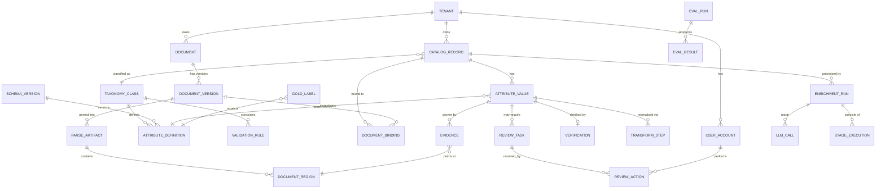

# Phase 5 — Data Architecture

> **Audience:** backend engineers. **Prerequisite:** `02-architecture.md`.
> **Governing principle:** the schema enforces the invariants. If a rule can be expressed as a
> constraint, it is a constraint — not a code comment.

---

## 1. Design principles

| Principle | Consequence in the schema |
|---|---|
| **Append-only for anything auditable** | `attribute_value` and `audit_event` are never `UPDATE`d. New rows supersede old ones. |
| **Evidence is not optional** | `evidence` has a `NOT NULL` FK to `attribute_value`, and a deferred constraint ensures every non-`Unknown` value has ≥1 evidence row (INV-1) |
| **Content addressing for documents** | `document_version.content_hash` is the identity. Same bytes = same version = cached parse. |
| **Tenant on every table from day one** | Multi-tenancy later becomes a policy change, not a migration (NFR-SCL) |
| **Declarative config lives in the DB, structural config lives in the repo** | Thresholds/routing → DB (hot-reload). Schemas/rules/prompts → versioned files (PR-reviewed) |
| **Soft delete only** | `deleted_at` everywhere; no `DELETE` statements in application code (INV-8) |
| **Reproducibility keys on every derived row** | `run_id`, `prompt_version`, `ruleset_version`, `model_id` (INV-10) |

---

## 2. Entity-relationship overview



---

## 3. Core tables

### 3.1 Input side (immutable)

| Table | Key columns | Notes |
|---|---|---|
| `catalog_record` | `id`, `tenant_id`, `mpn_raw`, `mpn_canonical`, `mpn_variants[]`, `description_raw`, `supplier_name`, `uom`, `source_batch_id`, `created_at` | **Never mutated.** All enrichment output references it. `mpn_variants` is a generated array of normalised forms for binding lookups |
| `import_batch` | `id`, `tenant_id`, `filename`, `row_count`, `error_count`, `raw_blob_key`, `created_by` | Original file retained byte-identical (FR-ING-7) |
| `import_error` | `batch_id`, `row_number`, `raw_row`, `error_code`, `message` | Per-row rejection report (FR-ING-6) |

### 3.2 Taxonomy & schema (versioned, loaded from repo files)

| Table | Key columns | Notes |
|---|---|---|
| `taxonomy_class` | `id`, `code`, `name`, `parent_id`, `external_ref` (ETIM/UNSPSC), `schema_version` | Hierarchical; `external_ref` keeps the door open to standards mapping |
| `attribute_definition` | `id`, `class_id`, `code`, `name`, `datatype`, `unit_dimension`, `allowed_values[]`, `is_mandatory`, `risk_tier`, `schema_version` | `risk_tier ∈ {0,1,2,3}` drives INV-9 routing |
| `validation_rule` | `id`, `class_id`, `rule_code`, `kind`, `expression`, `severity`, `ruleset_version` | Declarative; `expression` is a restricted DSL evaluated by pure code, **never `eval()`** |
| `unit_definition` | `code`, `dimension`, `to_canonical_num`, `to_canonical_den`, `display_format` | **Exact rational conversion factors**, not floats |

> **Why versioned rather than mutable:** FR-SCH-4 requires historical results to remain interpretable
> under their original schema. Every `attribute_value` carries the `schema_version` it was produced
> under. Changing a schema never retroactively invalidates or silently reinterprets old data.

### 3.3 Document side (content-addressed)

| Table | Key columns | Notes |
|---|---|---|
| `document` | `id`, `tenant_id`, `publisher`, `title`, `source_url`, `doc_type`, `first_seen_at` | Logical document |
| `document_version` | `id`, `document_id`, `content_hash` **UNIQUE**, `blob_key`, `page_count`, `fetched_at`, `effective_date`, `fetch_policy_ok` | Identity = content hash. Re-fetching identical bytes creates nothing |
| `parse_artifact` | `id`, `document_version_id`, `parser_name`, `parser_version`, `blob_key`, `parse_quality`, `has_text_layer`, `used_ocr` | **Cache key = (content_hash, parser_version)**. Parser upgrade produces a new artifact; old evidence still resolves |
| `document_region` | `id`, `parse_artifact_id`, `region_type`, `page`, `bbox`, `path` (`table:4/row:14/cell:3`), `text`, `parent_region_id` | Stable structural addressing — the anchor for all evidence |
| `document_binding` | `id`, `record_id`, `document_version_id`, `region_id` (nullable), `confidence`, `signals` JSONB, `method`, `created_by_kind` | Row-level binding for family documents (FR-DOC-3). `signals` stores the full retrieval-hierarchy breakdown |

### 3.4 Output side (append-only, the heart)

**`attribute_value`** — the central table.

| Column | Purpose |
|---|---|
| `id`, `tenant_id`, `record_id`, `attribute_definition_id` | Identity |
| `status` | `ACCEPTED` · `NEEDS_REVIEW` · `NEEDS_APPROVAL` · `UNKNOWN` · `SUPERSEDED` |
| `value_raw` | Verbatim as extracted, never overwritten |
| `value_canonical` | Post-normalisation, typed |
| `value_display` | Human-facing form (`1-1/4 in`) |
| `unit_canonical`, `unit_display` | Separate from the magnitude |
| `unknown_reason` | Closed enum, `NOT NULL` when `status='UNKNOWN'` (INV-4) |
| `provenance_kind` | `EXTRACTED` · `DERIVED` · `INFERRED` · `HUMAN` (INV-5) |
| `confidence` | Calibrated 0–1 |
| `confidence_signals` | JSONB — the full signal vector (FR-CNF-3) |
| `risk_tier` | Denormalised from the definition for fast routing queries |
| `run_id`, `schema_version`, `ruleset_version`, `prompt_version`, `extractor_model`, `verifier_model` | INV-10 reproducibility |
| `superseded_by_id`, `is_current` | Append-only versioning |
| `created_at`, `created_by_actor` | Audit |

**Constraints that enforce invariants:**

```
CHECK (status <> 'UNKNOWN' OR unknown_reason IS NOT NULL)          -- INV-4
CHECK (status <> 'ACCEPTED' OR verification_id IS NOT NULL)        -- INV-2
CHECK (status <> 'ACCEPTED' OR risk_tier <> 0)                     -- INV-9
CHECK (status = 'UNKNOWN' OR value_raw IS NOT NULL)
UNIQUE (record_id, attribute_definition_id) WHERE is_current       -- one current value
DEFERRED: every non-UNKNOWN current value has >= 1 evidence row    -- INV-1
```

> 💡 **`CHECK (status <> 'ACCEPTED' OR risk_tier <> 0)` is INV-9 as a database constraint.** It is
> physically impossible to auto-publish a pressure rating, even through a bug, even through a manual
> SQL statement. When a judge asks "how do you guarantee that?", showing a database constraint is a
> different class of answer from showing an `if` statement.

**`evidence`**

`id`, `attribute_value_id` (FK, NOT NULL), `kind` (**UH1**, `16-unilog-alignment.md` G1 —
`DOCUMENT_SPAN` | `SOURCE_ROW_SPAN` | `REFERENCE_TABLE_ROW`), `snippet_text` (**stored verbatim,
redundantly regardless of kind — see `03-ai-pipeline.md` §3.3**), `context_shown` JSONB, `rank`,
plus three nullable column groups — exactly one populated per row, matching `kind`:

- `DOCUMENT_SPAN`: `document_version_id`, `region_id`, `page`, `char_start`, `char_end`, `bbox`
- `SOURCE_ROW_SPAN`: `source_dataset`, `row_identifier`, `source_column`
- `REFERENCE_TABLE_ROW`: `reference_dataset`, `row_key`, `reference_field`

Evidence originally assumed every value traced to a parsed document. Most ground-truth values in
the UniHack dataset come from the supplier's own input row or an approved reference table (LOV,
manufacturer list) instead — `evidence` widened to a tagged union rather than gaining a second,
parallel table, so INV-1/INV-3 ("no unsourced assertion", "the citation must entail the value")
apply uniformly regardless of which kind of source a value came from. A `CHECK` constraint
(`ck_evidence_kind_field_shape`) enforces that exactly the right column group is non-null for a
row's `kind` — the DB-level mirror of each `Evidence` variant's constructor validation in
`domain/model/attribute.py`.

**`verification`**

`id`, `attribute_value_id`, `verdict` (`ENTAILED`/`PARTIAL`/`NOT_ENTAILED`), `rationale`,
`verifier_model`, `prompt_version`, `deterministic_check` (`exact`/`normalised`/`partial`/`fail`),
`dual_model_agreement`.

**`transform_step`**

`id`, `attribute_value_id`, `seq`, `rule_id`, `input_value`, `output_value`, `note`.
The full normalisation chain, e.g.
`1: parse_fraction "1-1/4" → 1.25` · `2: nps_designation 1.25 → NPS 1-1/4 (DN32)` · `3: no unit conversion (designation)`.

### 3.5 Process & audit

| Table | Purpose |
|---|---|
| `enrichment_run` | `id`, `tenant_id`, `kind` (batch/single/judge), `config_snapshot` JSONB, `corpus_hash`, `started_at`, `finished_at`, `cost_total`, `token_total` — the INV-10 manifest |
| `stage_execution` | `run_id`, `record_id`, `stage`, `state`, `attempt`, `started_at`, `duration_ms`, `error_code` — per-stage timing and resumability |
| `llm_call` | `run_id`, `record_id`, `stage`, `model`, `prompt_version`, `tokens_in`, `tokens_out`, `cached_tokens`, `cost_usd`, `latency_ms`, `outcome`, `request_hash` — cost, reproducibility, and `cached` replay mode |
| `audit_event` | `id`, `tenant_id`, `entity_type`, `entity_id`, `action`, `actor_id`, `actor_kind`, `before` JSONB, `after` JSONB, `cause`, `occurred_at` — **append-only, no updates, no deletes** (INV-8) |
| `job` | Queue table — see `02-architecture.md` §9 |

### 3.6 Review

| Table | Purpose |
|---|---|
| `review_task` | `id`, `attribute_value_id`, `record_id`, `reason_code`, `risk_tier`, `priority`, `state`, `assigned_to`, `opened_at`, `closed_at` |
| `review_action` | `id`, `task_id`, `actor_id`, `action`, `value_before`, `value_after`, `reason`, `duration_ms` — `duration_ms` powers the throughput metric (FR-RVW-9) |

### 3.7 Evaluation

| Table | Purpose |
|---|---|
| `gold_label` | `id`, `record_ref`, `attribute_code`, `expected_value`, `expected_unknown_reason`, `source_doc_ref`, `difficulty_tags[]`, `is_real`, `label_version`, `labelled_by` |
| `eval_run` | `id`, `git_sha`, `config_snapshot`, `gold_set_version`, `started_at` |
| `eval_result` | `eval_run_id`, `gold_label_id`, `predicted_value`, `outcome` (`TP`/`FP`/`FN`/`CORRECT_ABSTAIN`/`OVER_ABSTAIN`), `confidence` |
| `eval_metric` | `eval_run_id`, `metric_code`, `slice`, `value`, `ci_low`, `ci_high`, `n` — **confidence intervals stored, not just point estimates** (ASM-7) |

---

## 4. Indexes

| Index | Rationale |
|---|---|
| `catalog_record (tenant_id, mpn_canonical)` | Primary lookup |
| GIN on `catalog_record (mpn_variants)` | Binding search across normalised forms |
| GIN on `document_region` `to_tsvector(text)` | MPN search inside documents (FR-DOC-4 step 1–2) |
| `attribute_value (record_id) WHERE is_current` | Record detail page — the hottest query |
| `attribute_value (tenant_id, status, risk_tier, confidence)` | Review queue filtering |
| `attribute_value (tenant_id, unknown_reason) WHERE status='UNKNOWN'` | Reason-code dashboard |
| `evidence (attribute_value_id)` | Provenance expansion |
| `job (state, next_attempt_at)` partial on `state='queued'` | Queue claim — must be fast |
| `audit_event (entity_type, entity_id, occurred_at DESC)` | Lineage timeline |
| `llm_call (run_id)`, `llm_call (request_hash)` | Cost rollup + `cached` mode replay |
| Materialised view `catalog_health_mv` | Sub-second dashboards at 100k records (NFR-PERF-9), refreshed on run completion |

---

## 5. Versioning & history

| Entity | Strategy | Why |
|---|---|---|
| `attribute_value` | **Append + supersede.** New row, old row `is_current=false`, `superseded_by_id` set | Full history of every value a product ever had, with who/why. This is the "defend your data" capability P1 lacks today |
| `document_version` | Content-addressed; new bytes = new version | Detects manufacturer spec revisions automatically |
| Schema / rules / prompts | Semantic version in repo, recorded on every derived row | Historical explainability (FR-SCH-4, INV-10) |
| `gold_label` | `label_version`; changes require a PR | The gold set cannot be quietly tuned to flatter the model |

**Soft delete:** `deleted_at TIMESTAMPTZ NULL` on every user-facing entity. A repository base class
applies `WHERE deleted_at IS NULL` by default; bypassing it requires an explicit method. No
application code issues `DELETE`.

---

## 6. Search

| Need | Mechanism | Why not vectors |
|---|---|---|
| MPN inside document text | Postgres full-text + trigram | Exact identifiers — lexical beats semantic, and it's explainable |
| Catalog search (records) | Postgres full-text over description + attributes | Corpus is small; one dependency |
| Faceted browse of enriched attributes | Indexed relational queries on `attribute_value` | **This is the actual product output** — proving facets work on our own data is a demo beat |
| Semantic document search | **Deferred (OOS-12)** | Only justified beyond ~100k documents. pgvector is available in the same database when it is |

> **Say this if asked "why no vector database?"** — "Our identifiers are exact strings and our corpus
> is 400 documents. A vector store would be slower, less precise, and unexplainable to a reviewer.
> We use vectors when lexical retrieval stops working, and it hasn't."

---

## 7. Migrations, backup, recovery

| Concern | Approach |
|---|---|
| Migrations | Alembic, one migration per PR, **forward-only in shared environments**; every migration reviewed for lock duration |
| Additive-first policy | New columns nullable with defaults; drops happen a release *after* code stops using them |
| Seed data | Taxonomy, attribute definitions, rules, and unit definitions loaded from versioned repo files by an idempotent seeder — reproducible from a clean database |
| Backup (MVP) | Nightly `pg_dump` + blob store sync; **plus a pre-demo snapshot taken and verified** |
| Backup (cloud) | Managed provider PITR |
| Recovery drill | **Run once in M5:** restore into a clean environment and verify the demo works. An untested backup is not a backup |
| Blob durability | Documents are re-fetchable from source; parse artifacts are regenerable. **Only Postgres holds irreplaceable state** — which usefully narrows the DR surface to one system |
| Demo safety | A verified `demo.dump` + blob archive committed to a known location before the final week (see `12-hackathon-strategy.md`) |

---

## 8. Data lifecycle & retention

| Data | Retention | Rationale |
|---|---|---|
| Raw imports | Indefinite | Source of truth for reprocessing |
| Documents | Indefinite | Provenance targets must not rot |
| Parse artifacts | Regenerable; prunable after 90d | Cache, not truth |
| `attribute_value` history | Indefinite | Audit requirement |
| `audit_event` | Indefinite (partition by month) | Compliance |
| `llm_call` | 90d full, then aggregate | Volume control; cost rollups preserved |
| Eval runs | Indefinite | Quality trend is a product feature |
| Sessions | 30d | Security |

**PII:** effectively none by design — product data, not personal data. The only personal data is user
accounts and incidental supplier contact details appearing in documents. **Documented in
`08-security.md`; no PII is ever placed in a prompt.**

---

## ✔ Summary

- **Invariants are database constraints**, not conventions. INV-2, INV-4, and INV-9 are `CHECK`
  constraints; INV-1 is a deferred constraint; INV-8 is enforced by having no delete path.
- `attribute_value` is **append-only with supersession**, giving a complete history of every value a
  product ever held — the capability distributors conspicuously lack today.
- **Content addressing** on documents makes the parse cache correct by construction and detects
  manufacturer spec revisions for free.
- Evidence stores `snippet_text` **verbatim and redundantly** so provenance survives parser upgrades.
- **No vector database.** Exact identifiers over a 400-document corpus make lexical retrieval both
  better and explainable; pgvector is one extension away when scale justifies it.
- Only Postgres holds irreplaceable state — documents are re-fetchable, parse artifacts regenerable —
  which reduces disaster recovery to a single, well-understood system.

## ⚠ Risks

| # | Risk | Mitigation |
|---|---|---|
| C1 | Append-only `attribute_value` grows fast | Partial index on `is_current`; partition by tenant+month when >10M rows |
| C2 | Deferred INV-1 constraint is expensive on bulk insert | Validate per-transaction, not per-statement; benchmark at M4 |
| C3 | JSONB `confidence_signals` becomes an unqueryable dumping ground | Signals are a typed Pydantic model serialised to JSONB; schema change = migration + version bump |
| C4 | Schema versioning proliferates versions during rapid iteration | Only bump on *breaking* change; additive edits reuse the version until M4 freeze |
| C5 | Restoring a demo snapshot is never tested | **Scheduled DR drill in M5** — non-negotiable |

## 💡 Recommendations

1. Write the INV constraints **in the first migration**, before any pipeline code exists. Retrofitting
   constraints onto data that violates them is the classic way invariants quietly die.
2. Build the idempotent seeder in M0 — every developer and every CI run should get an identical
   taxonomy from repo files.
3. Take and *verify* a demo snapshot weekly from M3 onward, not once in week 4.
