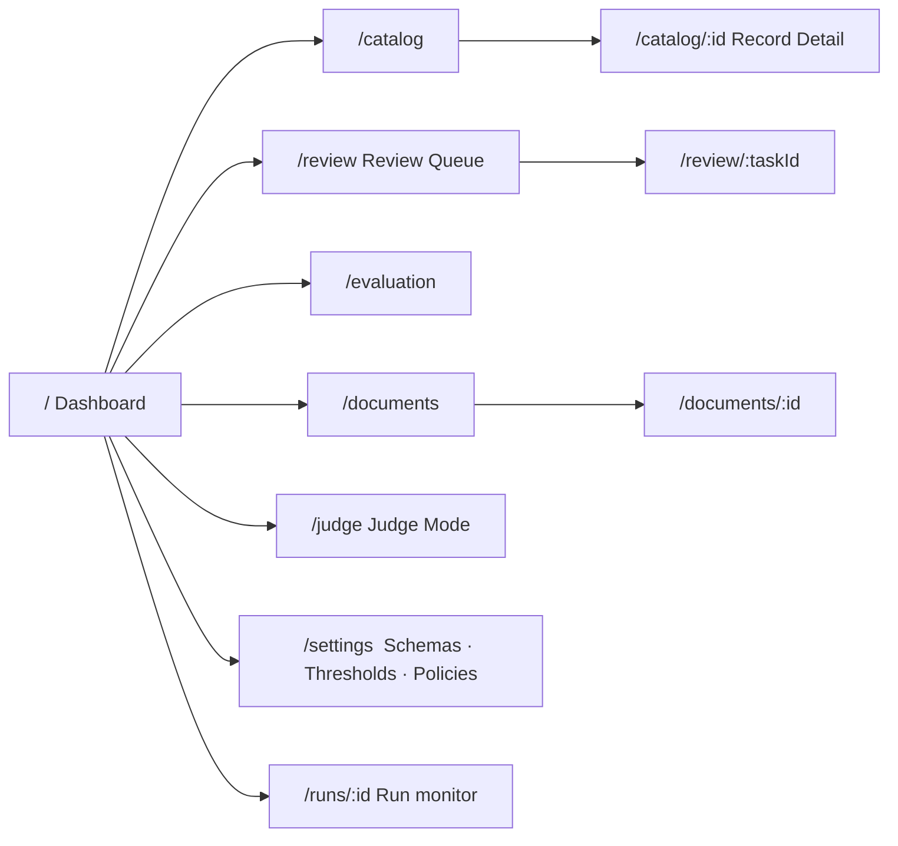

# Phase 7 — Frontend Architecture

> **Audience:** frontend engineers. **Prerequisite:** `api.md`.
> **Governing principle:** the UI's job is to make evidence *obvious* and review *fast*. Every design
> decision serves one of those two goals. Anything serving neither is decoration.

---

## 1. The two UX theses

### Thesis 1 — Provenance must be *spatial*, not textual

A citation rendered as text (`Source: apollo-70-100.pdf, p.2`) is a claim. A **highlighted rectangle
on the rendered page, right next to the value** is proof. The difference is the entire product.

Every attribute in the UI is one interaction away from seeing the exact pixels it came from.

### Thesis 2 — Review speed is the product's economic value

FR-RVW-9 requires ≥5× the manual baseline. That is not achieved by a prettier form; it is achieved by:

- **Never leaving the keyboard.** `J`/`K` navigate, `A` accept, `R` reject, `E` edit, `U` unknown,
  `Enter` next. A trained reviewer should never touch the mouse.
- **Never waiting.** The next task's document page is prefetched while the current one is open.
- **Never hunting.** The evidence span is already highlighted and scrolled into view.
- **Never re-deciding.** Similar pending values are grouped so one decision resolves many.

> 💡 The accessibility requirement (NFR-ACC-2, full keyboard operability) and the throughput
> requirement are **the same requirement**. Build for the keyboard and both are satisfied. Say this
> in the pitch — it reframes accessibility from compliance cost to performance feature.

---

## 2. Pages & navigation



| Route | Purpose | Primary user | Priority |
|---|---|---|---|
| `/` | Catalog health, STP, cost, `Unknown` breakdown, quality trend | eComm Director, Data Mgr | M |
| `/catalog` | Searchable, filterable record list with completeness | Data Mgr | M |
| `/catalog/:id` | **Record Detail** — all attributes, values, confidence, provenance | Everyone | M |
| `/review` | **Review Queue** — the throughput engine | Data Steward | M |
| `/documents` | Corpus browser, binding health, unbound records | Ops | M |
| `/evaluation` | Frontier chart, calibration, per-slice metrics, ablation | Judges, engineers | M |
| `/judge` | **Judge Mode** — live single-record run with stage narration | Judges | M |
| `/runs/:id` | Live run monitor with per-stage progress | Ops | M |
| `/settings` | Schemas, thresholds, tier policy, model routing | Admin | S |
| `/import` | Upload + column mapping | Data Mgr | M |

---

## 3. Wireframes

### 3.1 Record Detail — the provenance showcase

```
┌───────────────────────────────────────────────────────────────────────────────────┐
│ ← Catalog    ABC-123  ·  1/2 BRS BALL VLV 600WOG          [Export] [Re-enrich]    │
│ Class: Ball Valve, Bronze/Brass  (0.97 ✓ rule+llm)     Completeness 18/22  ▓▓▓▓░  │
├──────────────────────────────────────────┬────────────────────────────────────────┤
│ ATTRIBUTES                    ⌄ group by │  SOURCE DOCUMENT                       │
│                                          │  apollo-70-100-series.pdf  · p.2 of 4  │
│ ▸ Identification                         │  ┌──────────────────────────────────┐  │
│ ▾ Dimensional                            │  │ CATALOG NO.  SIZE   CV    WEIGHT │  │
│   Nominal Size      1/2 in  (NPS)        │  │ 70-102-01    1/4"   4.5    0.31  │  │
│     ● 0.99  EXTRACTED   [why?]  ◀────────┼──┤▓70-104-01▓▓▓1/2"▓▓▓12.0▓▓▓0.52▓▓▓│  │
│   End Conn (in)     NPT Female           │  │ 70-106-01    3/4"   28.0   0.86  │  │
│     ● 0.96  EXTRACTED   [why?]           │  └──────────────────────────────────┘  │
│   Port Type         Full Port            │                                        │
│     ● 0.94  EXTRACTED   [why?]           │  Row bound: catalog no. 70-104-01      │
│                                          │  Binding confidence 0.98               │
│ ▾ Pressure / Temperature      ⚠ TIER 0   │   exact MPN ✓ · supplier ✓ · class ✓   │
│   Pressure (WOG)    600 psi              │                                        │
│     ⏸ AWAITING APPROVAL  0.97  [approve] │  [◀ prev page]  [next page ▶]  [⤢]     │
│   Pressure (WSP)    ❓ Unknown            │                                        │
│     NOT_IN_DOCUMENT  ·  what would fix?  │                                        │
│   ANSI Class        ❓ Unknown            │                                        │
│     ⚠ Cannot be derived from WOG rating  │                                        │
│        — different rating basis  [why?]  │                                        │
│                                          │                                        │
│ ▾ Materials                              │                                        │
│   Body Material     Brass                │                                        │
│     ● 0.91  INFERRED from description    │                                        │
│     ⚠ not confirmed in document [review] │                                        │
└──────────────────────────────────────────┴────────────────────────────────────────┘
```

**Three deliberate demo beats are visible in one screenshot:** the highlighted family-table row, the
Tier-0 approval gate, and the *refusal* to derive ANSI Class from a WOG rating.

### 3.2 "Why?" panel — explanation from stored provenance (never LLM-narrated)

```
┌─ Why: Pressure Rating (WOG) = 600 psi ──────────────────────────────┐
│ EVIDENCE                                                            │
│  Document  apollo-70-100-series.pdf  (fetched 2026-07-14, rev 2024) │
│  Location  page 2 · table 1 · row 14 · cell 6                       │
│  Verbatim  "600 WOG"                          [show on page ▸]      │
│  Context   Column header: "PRESSURE RATING"                          │
│            Table caption: "70-100 SERIES BRONZE BALL VALVES"        │
│                                                                     │
│ VERIFICATION                                                        │
│  Span check      EXACT MATCH            ✓                           │
│  Independent     ENTAILED               ✓  (verifier: separate model)│
│  Rationale       "Row 14 corresponds to catalog no. 70-104-01,      │
│                   which matches the requested MPN. Cell states       │
│                   600 WOG under the pressure rating column."         │
│                                                                     │
│ VALIDATION                                                          │
│  ✓ PRS-001  type: numeric+unit                                      │
│  ✓ PRS-004  range for brass body: 125–1000 psi                      │
│  ✓ PRS-011  cross-field: WSP ≤ WOG (WSP unknown — skipped)          │
│                                                                     │
│ NORMALISATION                                                       │
│  1  parse "600 WOG"      → magnitude 600, media WOG                 │
│  2  unit psi (canonical) → 600 psi                                  │
│  3  media preserved      → NOT converted to ANSI Class (rule NRM-17)│
│                                                                     │
│ CONFIDENCE  0.97                                                    │
│  doc binding 0.98 · row binding 0.98 · parse 1.00 · span EXACT      │
│  verification ENTAILED · validation PASS · provenance EXTRACTED     │
│  attribute prior 0.96                                               │
│                                                                     │
│ POLICY   Tier 0 — human approval required regardless of confidence  │
└─────────────────────────────────────────────────────────────────────┘
```

> This panel is the product in one screen. It should be reachable in **one click from anywhere** and
> it should be the first thing shown in the demo after the problem slide.

### 3.3 Review Queue — built for speed

```
┌───────────────────────────────────────────────────────────────────────────────────┐
│ REVIEW QUEUE            412 open   ·   ~2.4 h remaining at current rate           │
│ [ VERIFICATION_FAILED 88 ] [ BELOW_THRESHOLD 141 ] [ TIER-0 APPROVAL 96 ]         │
│ [ NO_DOCUMENT 51 ] [ AMBIGUOUS 24 ] [ CONFLICTING 12 ]        ⌨ shortcuts: ?      │
├───────────────────────────────────────┬───────────────────────────────────────────┤
│ TASK 1 of 88 · VERIFICATION_FAILED    │  apollo-70-100-series.pdf · p.2           │
│                                       │  ┌─────────────────────────────────────┐  │
│ ABC-123 · 1/2 BRS BALL VLV 600WOG     │  │ 70-102-01   1/4"  400 WOG           │  │
│ Attribute:  Seat Material             │  │▓70-104-01▓▓▓1/2"▓▓600 WOG▓▓▓▓▓▓▓▓▓▓▓│  │
│                                       │  │ 70-106-01   3/4"  600 WOG           │  │
│ Proposed:   PTFE                      │  └─────────────────────────────────────┘  │
│ Rejected because:                     │                                           │
│   verifier: NOT_ENTAILED —            │  ⚠ The proposed span came from row 15,    │
│   "span belongs to catalog 70-106-01, │    not the bound row 14.                  │
│    not the requested 70-104-01"       │                                           │
│                                       │                                           │
│ ┌─ Your decision ─────────────────────┴───────────────────────────────────────┐   │
│ │ [A] Accept proposed   [R] Reject → Unknown   [E] Edit value   [D] Reattach  │   │
│ │ [S] Skip   [B] Bulk: apply to 14 similar tasks in this document             │   │
│ └─────────────────────────────────────────────────────────────────────────────┘   │
│ Session: 47 resolved · 38/hr · median 71s          Baseline manual: ~7/hr         │
└───────────────────────────────────────────────────────────────────────────────────┘
```

**Note the live throughput counter against the manual baseline.** It turns the reviewer's screen into
the business case, and it makes AC-RVW measurable without instrumentation work later.

### 3.4 Judge Mode — the live-run narration

```
┌───────────────────────────────────────────────────────────────────────────────────┐
│ JUDGE MODE — run any product through the full pipeline                            │
│ MPN [ ______________ ]  Description [ __________________________ ]  [Run ▶]       │
│ Optional: drop a spec PDF here, or let us find one                                │
├───────────────────────────────────────────────────────────────────────────────────┤
│ ✓ CLS  Classified: Ball Valve (Bronze/Brass)     0.97   rules+llm        0.4s     │
│ ✓ SCH  Schema resolved: 22 mandatory attributes                          0.0s     │
│ ✓ DOC  Bound: apollo-70-100-series.pdf, table 1 row 14   0.98             1.1s     │
│ ✓ PRS  Parsed (cache hit) · 4 pages · 3 tables · text layer OK           0.1s     │
│ ⟳ EXT  Extracting 22 attributes…            ▓▓▓▓▓▓▓▓▓░░░  17/22          6.2s     │
│ ○ VER  Verifying…                                                                 │
│ ○ VAL  ○ NRM  ○ CNF                                                               │
│                                                                                   │
│ Live: 14 extracted · 3 unknown · 0 rejected      Cost so far: $0.041              │
└───────────────────────────────────────────────────────────────────────────────────┘
```

Stage-by-stage narration is what makes a 40-second run feel impressive instead of slow (NFR-PERF-11).

---

## 4. Component hierarchy

```
AppShell
├── Nav / CommandPalette (⌘K)
├── DashboardPage
│   └── MetricTile · StpFrontierChart · UnknownReasonBreakdown · CostPanel · TrendChart
├── CatalogPage → RecordTable (virtualised) · FilterBar · CompletenessBar
├── RecordDetailPage
│   ├── AttributePanel
│   │   └── AttributeGroup → AttributeRow
│   │        ├── ValueDisplay · ConfidenceBadge · ProvenanceChip · TierBadge
│   │        └── WhyPanel (evidence · verification · validation · normalisation · signals)
│   └── DocumentViewer
│        ├── PageCanvas · SpanHighlight · RegionOverlay · PageControls
├── ReviewPage
│   ├── QueueSidebar (reason-code tabs + counts)
│   ├── TaskCard → DecisionBar · BulkPanel
│   ├── DocumentViewer  (shared component — same one as RecordDetail)
│   └── ThroughputMeter
├── JudgePage → RunInput · StageTimeline · LiveResultPanel
├── EvaluationPage → FrontierChart · ReliabilityDiagram · SliceTable · AblationTable
└── SettingsPage → SchemaBrowser · ThresholdEditor · TierPolicyEditor
```

**`DocumentViewer` is the highest-value shared component.** It appears on three pages, it is what
makes provenance spatial, and it is the riskiest single piece of frontend work. **Build it first,
in M2** — before the review queue needs it and before the demo depends on it.

---

## 5. Design system

| Token group | Decision |
|---|---|
| **Base** | Tailwind + shadcn/ui (Radix primitives — keyboard and ARIA behaviour for free, satisfying NFR-ACC cheaply) |
| **Typography** | One sans family; tabular numerals for all metric and value displays |
| **Density** | Compact by default. This is a data tool used for hours, not a marketing site |
| **Colour semantics** | Accepted · Needs review · Unknown · Tier-0 pending · Rejected |
| **Confidence encoding** | **Never colour alone (NFR-ACC-3).** Always numeral + icon + colour: `● 0.97`, `◐ 0.81`, `○ 0.44`, `❓ Unknown` |
| **Provenance encoding** | Distinct chips: `EXTRACTED` · `DERIVED` · `INFERRED` · `HUMAN` — always with text |
| **Motion** | Minimal; respects `prefers-reduced-motion`. Stage timeline is the only animated element |
| **Theme** | Light and dark, both tested |

> ⚠ **The colour trap:** the instinctive design is a red/amber/green confidence system. It fails
> WCAG, it is unusable for ~8% of male reviewers, and it encodes a continuous quantity as three
> buckets. Numeral + shape + colour costs nothing extra and is strictly better.

---

## 6. State management

| State | Tool | Why |
|---|---|---|
| Server data | **TanStack Query** | Caching, invalidation, background refetch, prefetching — the review queue's prefetch requirement makes this non-negotiable |
| Run progress | **SSE subscription** → query cache updates | Live stage narration |
| Filters, sort, pagination | **URL search params** | Shareable, back-button-correct, no state duplication |
| Review session (position, session stats) | React state + `sessionStorage` | Survives refresh (FR-RVW-10) |
| Forms | react-hook-form + zod | Client validation mirrors server DTOs |
| Global client state | **None** | If Redux/Zustand seems necessary, the state probably belongs in the URL or the server |

**Prefetch strategy for review throughput:** when task *n* opens, prefetch task *n+1*'s payload and
its document page image. Reviewer perceives zero load time, which is where a large share of the 5×
throughput actually comes from.

---

## 7. Performance

| Requirement | Technique |
|---|---|
| NFR-PERF-7 (queue item ≤1.5s p95) | Prefetch next task; server-rendered page images cached by `(doc_hash, page)`; skeletons never block interaction |
| NFR-PERF-8 (keystroke ≤100ms) | Keyboard handlers never await network; optimistic UI with rollback on error |
| Large catalogs | Virtualised tables (TanStack Virtual); cursor pagination |
| PDF rendering | **Server-side page rasterisation to cached images**, not client-side PDF.js on every open. Faster, consistent, avoids a heavy client bundle |
| Charts | Lightweight SVG charts; no heavy charting library |
| Bundle | Route-level code splitting; Judge Mode and Evaluation lazy-loaded |

> **Server-side page rasterisation is the right call** and is worth defending: it makes the highlight
> overlay coordinate system identical to the parser's bbox coordinate system, eliminating an entire
> class of "the highlight is 12px off" bugs that would otherwise consume a day in week 3.

---

## 8. Accessibility (NFR-ACC-1…5)

| Requirement | Implementation |
|---|---|
| Full keyboard operability | Every action has a shortcut; a visible shortcut legend (`?`); logical tab order; no keyboard traps |
| Focus management | Focus moves to the new task on advance; focus returns to trigger on dialog close; visible focus rings never removed |
| Screen readers | Confidence, provenance kind, tier, and reason code all have text equivalents; the document viewer exposes the evidence snippet as text, not just as an image |
| Contrast | ≥4.5:1 verified in both themes |
| No colour-only encoding | NFR-ACC-3 as above |
| Motion | `prefers-reduced-motion` respected |
| Testing | `axe-core` in Playwright E2E; one manual screen-reader pass in M6 |

---

## 9. Responsive behaviour

| Breakpoint | Behaviour |
|---|---|
| ≥1440px | Full split view — attributes + document side by side (the primary working mode) |
| 1024–1440px | Split view with a collapsible document pane |
| 768–1024px | Stacked: attributes with a document drawer |
| <768px | **Read-only.** Dashboard and record detail work; review is desktop-only by design |

Review is explicitly not a mobile workflow. Pretending otherwise would cost days and serve nobody —
document it as a decision rather than a gap.

---

## ✔ Summary

- **Provenance is spatial**: every value is one interaction from a highlighted rectangle on the
  rendered source page. A text citation is a claim; a highlight is proof.
- **The keyboard is the throughput mechanism** — and it makes the accessibility requirement and the
  5×-throughput requirement the same piece of work.
- The **"Why?" panel** is the product in one screen: evidence, verification, validation,
  normalisation chain, confidence signals, and policy — all rendered from stored provenance, never
  narrated by a model.
- `DocumentViewer` is the highest-risk, highest-value component and is scheduled **first (M2)**.
- **Server-side page rasterisation** aligns the highlight coordinate system with the parser's,
  eliminating a class of bugs before it exists.
- Confidence is never encoded by colour alone; the live throughput meter turns the reviewer's screen
  into the business case.

## ⚠ Risks

| # | Risk | Mitigation |
|---|---|---|
| E1 | Highlight coordinates misalign with rendered pages | Server-side rasterisation at a fixed DPI; a visual regression test with known-position fixtures |
| E2 | `DocumentViewer` slips and blocks three pages | Scheduled M2, ahead of dependents; a plain image + rectangle fallback is acceptable |
| E3 | Review UI is beautiful but slow, failing the 5× claim | Prefetching built in from the first version; throughput meter measures it continuously, not once |
| E4 | Dashboard becomes vanity metrics | Every tile maps to a named requirement (STP, cost/SKU, reason-code mix) |
| E5 | Judge Mode hangs on a slow run and dies on stage | Hard timeout with graceful partial results (FR-JDG-4); a pre-cached fallback record one keystroke away |

## 💡 Recommendations

1. Build `DocumentViewer` in **M2**, before the review queue exists. It de-risks three pages at once.
2. Put the **throughput meter in from the first review-queue version** — you need weeks of readings,
   not one demo-day measurement.
3. Design the "Why?" panel before the review queue. It clarifies exactly what the API must return,
   which in turn clarifies what the pipeline must persist.
4. Keep a `?` shortcut overlay from day one. It is 20 minutes of work and it makes the demo look
   like a mature tool.
