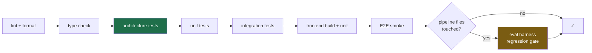
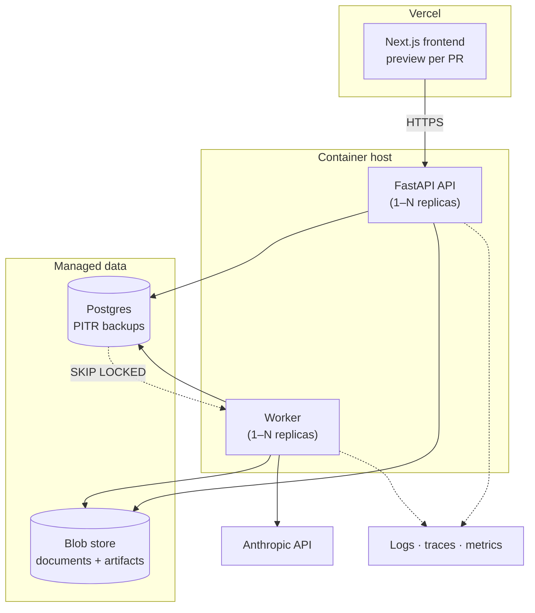

# Phase 8 — DevOps & Delivery

> **Audience:** all engineers. **Governing principle:** the demo path must work on a laptop with no
> internet. Everything else is a bonus.

---

## 1. Repository structure — single repo, not a heavyweight monorepo

```
openspec/
├── CLAUDE.md                    # Evergreen agent instructions (150–250 lines)
├── README.md                    # Human quickstart
├── docker-compose.yml           # Postgres, MinIO, backend, worker, frontend
├── Makefile                     # make up · make test · make eval · make seed · make demo
├── .github/workflows/           # ci.yml · eval.yml · deploy.yml
├── docs/                        # This documentation tree
├── backend/                     # Python service (see 05-backend.md)
├── frontend/                    # Next.js app (see 06-frontend.md)
├── corpus/                      # Document corpus manifest + fetch scripts (PDFs gitignored)
├── evaluation/                  # Gold set fixtures, eval reports, ablation configs
└── scripts/                     # seed, snapshot, restore, record-llm-cache
```

**Decision: single repo, two independently-buildable apps, no Turborepo/Nx.**

| Force | Consequence |
|---|---|
| Two languages (Python + TS) | Turborepo/Nx add value for many JS packages; here they add config for no benefit |
| 3 developers, 4 weeks | Atomic cross-cutting changes (API contract + client) in one PR is worth more than build-graph caching |
| Docs and code must stay in sync | Same repo, same PR, same review |
| CI simplicity | Two independent jobs with path filters. ~30 lines of YAML |

**Rejected:** separate repos (contract drift, doubled review overhead), full monorepo tooling
(premature), single-language rewrite (throws away team strengths).

---

## 2. Git workflow

**Trunk-based with short-lived branches.**

| Rule | Detail |
|---|---|
| Branches | `feat/<module>-<short>`, `fix/…`, `docs/…`. Lifetime ≤ 2 days |
| `main` | Always green, always deployable, always demoable |
| PRs | Required. One reviewer. **< 400 lines changed** where possible |
| Merge | Squash. Conventional Commits in the squash title |
| Milestone tags | `m0`, `m1`, … tagged on `main` at each milestone gate — **a known-good rollback point** |
| Release branch | `release/demo` cut at M6 and frozen; only demo-critical fixes land there |

> ⚠ **Three developers with Claude Code will produce merge conflicts at an unusual rate.** The
> mitigations are module ownership (each developer primarily owns distinct module directories),
> short branches, and merging `main` into your branch daily. Agree module ownership at M0 kickoff
> even though roles aren't formally separated.

---

## 3. Environments

| Env | Where | Data | Purpose |
|---|---|---|---|
| `local` | Docker Compose | Seeded taxonomy + sample corpus + recorded LLM cache | Daily development |
| `test` | CI ephemeral | Fixtures only | Automated verification |
| `preview` | Vercel (frontend) + branch DB | Seeded | Per-PR review |
| `demo` | **Local laptop, pre-warmed** | Full corpus, cached parses, cached LLM responses | **The submission demo** |
| `cloud` | Container host + managed Postgres | Full corpus | Judge-accessible link, deployability proof |

**`demo` is a first-class environment with its own snapshot, its own verification checklist, and its
own dry run.** It is not "local with the demo data loaded" — it is a versioned, restorable artifact
(`scripts/snapshot.sh`, `scripts/restore.sh`) that is rebuilt and re-verified weekly from M3.

---

## 4. Configuration & secrets

| Class | Storage | Notes |
|---|---|---|
| Structural config (taxonomy, rules, prompts, units) | Versioned repo files | PR-reviewed, part of INV-10 |
| Operational config (thresholds, routing, tier policy) | Database, hot-reloadable | FR-ADM-4 |
| Environment config | `.env` locally, platform env vars in cloud | `.env.example` committed and complete |
| Secrets (API keys, DB URLs) | Platform secret store; never in the repo | NFR-SEC-5 |
| Secret scanning | `gitleaks` in pre-commit + CI | Blocks the commit, not just the PR |

Settings are a single typed `Settings` object loaded at startup that **fails fast on missing or
malformed values.** A service that boots with a missing API key and fails on the first request in
week 4 is a preventable demo failure.

---

## 5. Docker

| Image | Base | Notes |
|---|---|---|
| `backend` | `python:3.12-slim` | Multi-stage; `uv` for fast installs; non-root user; healthcheck on `/health` |
| `worker` | **Same image**, different entrypoint | Guarantees identical dependencies and code |
| `frontend` | `node:22-alpine` → standalone Next output | Dev uses hot reload |
| `postgres` | `postgres:16` | Named volume, init script |
| `minio` | S3-compatible | Local blob store; the `BlobStore` port makes S3 a config change |

`docker compose up` → seeded database, corpus mounted, LLM cache primed, app reachable.
**Target: clone → running in ≤15 minutes (NFR-MNT-8), verified by a fresh-machine test at M2 and M5.**

---

## 6. CI/CD

### 6.1 Pipeline (`ci.yml`) — runs on every PR



| Stage | Gate | Time budget |
|---|---|---|
| Lint + format (`ruff`, `eslint`, `prettier`) | Must pass | 30s |
| Type check (`mypy --strict`, `tsc`) | Must pass | 60s |
| **Architecture tests** | Must pass — layering, INV-1, INV-6, no `eval`, no raw `DELETE` | 15s |
| Unit tests | ≥90% domain, **100% branch on `nrm/`** | 90s |
| Integration tests | ≥70% overall; **constraint-rejection tests** | 3m |
| Frontend build + unit + axe | Must pass | 2m |
| E2E smoke (Playwright) | Ingest → enrich → review → export | 3m |
| **Eval regression** (conditional) | No metric regresses beyond tolerance | ≤10m |
| Security (`pip-audit`, `npm audit`, `gitleaks`) | No criticals | 60s |

**Total ≤ 12 minutes on the heaviest path.** If it exceeds 15, it stops being run and starts being
bypassed — which is how quality gates die.

### 6.2 Eval workflow (`eval.yml`)

Runs nightly and on-demand against the full gold set in `cached` mode (free, deterministic) plus a
weekly `live` run. Publishes the frontier chart, reliability diagram, and ablation table as build
artifacts, and appends to the quality trend surfaced on `/evaluation`.

> **The quality trend chart in the deck is generated by CI over four weeks.** That is a far stronger
> artifact than a single measurement taken the night before submission, and it costs nothing extra
> if the harness exists from M1.

### 6.3 Deploy (`deploy.yml`)

| Target | Trigger | Mechanism |
|---|---|---|
| Frontend preview | Every PR | Vercel automatic |
| Frontend production | Merge to `main` | Vercel |
| Backend + worker | Merge to `main` | Build image → push → rolling restart |
| Migrations | Pre-deploy step | Alembic, forward-only, additive-first |

---

## 7. Rollback & disaster recovery

| Scenario | Response | Prepared in advance |
|---|---|---|
| Bad deploy | Redeploy the previous image tag / Vercel instant rollback | Immutable tags |
| Bad migration | **Additive-first policy means most migrations are trivially reversible**; destructive changes require an explicit paired down-migration and a review sign-off | Policy |
| Corrupt demo data | `scripts/restore.sh` from the verified snapshot | Weekly snapshot from M3 |
| Model provider outage during demo | Switch to `cached` mode — one env var | Recorded the night before |
| Laptop failure at the demo | Second machine with the same snapshot restored + a recorded video fallback | M6 checklist |
| Corpus loss | Re-fetch from `corpus/manifest.json` | Manifest committed; PDFs are not |
| Total local loss | Cloud deployment as a live backup | Deployed by M5 |

**DR drill scheduled in M5**: wipe local state, restore from snapshot, verify the demo script
end-to-end. An untested restore is not a backup.

---

## 8. Infrastructure diagram (cloud)



**Scaling levers, all deployment-only:** API replicas (stateless), worker replicas (stateless),
Postgres tier, blob storage (already elastic). **No code change is required to scale any of them** —
which is the honest and defensible version of "enterprise-ready."

---

## 9. Monitoring

| Layer | Signal | Alert |
|---|---|---|
| Health | `/health` (liveness), `/ready` (DB + blob reachable) | Platform restart |
| Queue | Depth, oldest queued age, dead-letter count | Depth > 5k or dead > 0 |
| Pipeline | Per-stage p95 latency, error rate | p95 > 2× baseline |
| Cost | Spend per run, cumulative daily | > 80% of budget |
| Quality | Nightly eval metric deltas | Any metric regresses > tolerance |
| LLM provider | Error rate, latency, rate-limit hits | Sustained 429s |

For a 4-week build, alerting is a Slack/webhook notification and a dashboard tile — not PagerDuty.
**Say that explicitly rather than implying a maturity you don't have.**

---

## ✔ Summary

- **Single repo, two apps, no monorepo tooling** — atomic contract-plus-client changes beat build
  caching at this size.
- Trunk-based with ≤2-day branches, `main` always demoable, **milestone tags as known-good rollback
  points**.
- **`demo` is a first-class environment** with a versioned, restorable snapshot rebuilt and verified
  weekly from M3 — not an afterthought assembled the night before.
- CI budget capped at ~12 minutes because a slow pipeline is a bypassed pipeline; architecture tests
  and the eval regression gate are the two non-standard stages and both are load-bearing.
- Every scaling lever is a deployment change, not a code change — the honest form of "enterprise-ready."
- DR drill scheduled in M5. An untested restore is not a backup.

## ⚠ Risks

| # | Risk | Mitigation |
|---|---|---|
| F1 | CI creeps past 15 minutes and gets bypassed | Conditional eval gate; parallel jobs; time budget tracked as a metric |
| F2 | Merge conflict churn from 3 AI-assisted developers | Module ownership at M0; ≤2-day branches; daily merge from `main` |
| F3 | Cloud deploy consumes days for a bonus deliverable | Timeboxed to M5, one day; demo never depends on it |
| F4 | Demo snapshot drifts from `main` and breaks on demo day | Weekly rebuild + verification from M3; frozen `release/demo` branch |
| F5 | `docker compose up` quietly breaks and nobody notices for days | Fresh-machine test in CI weekly; it is a milestone gate item |

## 💡 Recommendations

1. **Write the `Makefile` and `docker-compose.yml` on day one.** Every hour of friction in the local
   loop is multiplied by three developers and twenty days.
2. Tag `m0`…`m6` on `main`. When something breaks in week 4, the ability to bisect to a known-good
   milestone is worth more than any amount of debugging.
3. Start the snapshot/restore scripts at M3, not M6. They take an hour and they are the difference
   between a recoverable and an unrecoverable demo-day failure.
