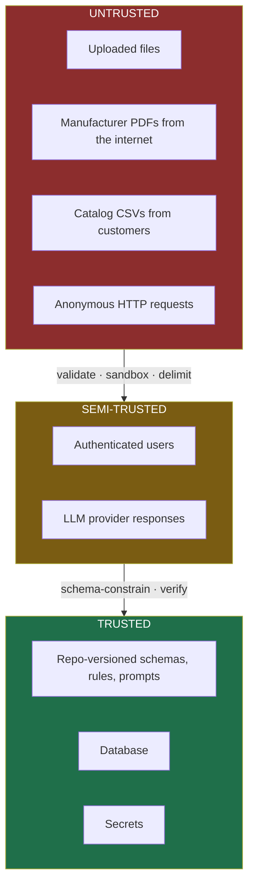

# Phase 9 — Security Review

> **Audience:** all engineers, plus the security reviewer at any prospective enterprise customer.
> **Governing principle:** our entire input surface is documents written by third parties, fed to a
> language model. That is the threat model. Everything else is standard web application hygiene.

---

## 1. Assets & trust boundaries

**Note the unusual boundary: LLM responses are semi-trusted, not trusted.** They are schema-
constrained, span-checked, independently verified, and deterministically validated before anything
they contain is believed. That is a security posture as much as a quality one — and it is the
strongest possible answer to "what if the model is compromised or manipulated?"

| Asset | Sensitivity | Threat |
|---|---|---|
| Customer catalog data | Medium — commercially sensitive (SKUs, suppliers) | Exfiltration, cross-tenant leakage |
| Manufacturer documents | Low–medium — mostly public, IP-encumbered | Redistribution liability |
| Enriched attributes + provenance | **High** — the product's value | Tampering, silent corruption |
| Audit log | **High** — the trust guarantee | Tampering, deletion |
| API keys / DB credentials | Critical | Compromise |
| User accounts | Low (small volume of PII) | Account takeover |

---

## 2. Threat model (STRIDE)

| # | Threat | Category | Impact | Likelihood | Mitigation |
|---|---|---|---|---|---|
| T1 | **Prompt injection via document content** | Tampering | **High** — fabricated specs enter a safety-relevant catalog | **High** | INV-7 delimited untrusted blocks · structured output only · span containment · independent verification · adversarial eval slice in CI · invisible-text detection |
| T2 | **Malicious PDF exploits the parser** | Elevation | High — RCE on a worker | Medium | Sandboxed parse process, resource + time limits, memory-safe parsers, no shell-outs, non-root container |
| T3 | **Cross-tenant data leakage** | Disclosure | High | Medium | `tenant_id` on every table; repository base class scopes every query; a test asserts no repository method can be called without a tenant scope |
| T4 | **Audit log tampering** | Repudiation | **High — destroys the product thesis** | Low | Append-only table; no application delete/update path; DB role lacking `UPDATE`/`DELETE` on `audit_event`; periodic hash chaining (Track B) |
| T5 | **SSRF via document fetch URL** | Disclosure | High — internal network access | Medium | URL allowlist, DNS resolution check against private ranges, redirect limit, timeout, egress restricted |
| T6 | **Zip bomb / decompression DoS** | DoS | Medium | Medium | Size caps (50MB), page count caps, parse timeouts, per-job memory limits |
| T7 | **Data exfiltration to the LLM provider** | Disclosure | Medium — customer catalog leaves the perimeter | **Certain by design** | Documented data-flow statement; zero-retention provider config; per-tenant external-model toggle; self-hosted path on the roadmap |
| T8 | **Credential compromise** | Elevation | Critical | Low | Secret store only, scanning in pre-commit + CI, rotation documented |
| T9 | **Auth bypass to review/approve** | Elevation | High — unauthorised Tier-0 approval | Medium | Authorization in the use case layer, not the router; RBAC tests per role; INV-9 also enforced as a DB constraint |
| T10 | **Cost-exhaustion attack** (mass enrichment requests) | DoS | Medium — financial | Medium | Per-user and per-tenant rate limits, per-run token budgets, spend alerting |
| T11 | **Malicious CSV formula injection** on export | Tampering | Medium — attacks the *consumer* of our export | Medium | Prefix leading `=`, `+`, `-`, `@` in exported CSV cells |
| T12 | **Poisoned document corpus** (attacker-supplied wrong spec sheet) | Tampering | High | Low | Publisher tracking, source URL provenance, binding confidence, conflicting-source detection, human review of low-confidence bindings |

> **T1 and T4 are the two that matter most.** T1 because it directly attacks the product's core
> claim; T4 because a mutable audit log means the provenance guarantee is unenforceable. Both should
> be explicitly addressed in the pitch — a trust product that hasn't threat-modelled its own trust
> mechanism is not credible.

---

## 3. Prompt injection defence in depth (INV-7)

| Layer | Control | Defeats |
|---|---|---|
| 1 | Document text appears **only** inside delimited untrusted blocks, never in the system prompt | Direct instruction override |
| 2 | Explicit data-not-instruction directive adjacent to the block | Naive injections |
| 3 | **Structured output only** — the model returns a schema-constrained object with no free-text channel to act through | Instruction-following side effects |
| 4 | **Span containment check (INV-3)** — an injected value must still appear verbatim in the bound region | Values invented from injected text elsewhere |
| 5 | **Independent verification (INV-2)** with an asymmetric prompt | Injections that survive layers 1–4 |
| 6 | **Deterministic validation (VAL)** | Implausible injected values (e.g. 50000 WOG on a brass valve) |
| 7 | **Tier-0 human gate (INV-9)** | Everything, for the attributes that matter most |
| 8 | Content sanitisation: strip zero-width and control characters, normalise Unicode confusables, **detect and flag invisible/near-invisible text** | Hidden-text attacks |
| 9 | Adversarial eval slice (~30 payload documents) run in CI | Regression |

**Target: QR-12 ≥ 98% resistance, measured, not asserted.**

> 💡 **The layered structure is the point.** No single control is sufficient — layer 3 defeats most
> real attacks, but layers 4–7 mean that even a *successful* injection produces a value that must
> still appear verbatim in the document, be independently entailed, pass physical plausibility
> rules, and clear a human for anything safety-relevant. **Injecting a fabricated pressure rating
> into our pipeline requires defeating six independent mechanisms, four of which are deterministic.**

---

## 4. File upload security (NFR-SEC-2)

| Control | Detail |
|---|---|
| Type validation | **Magic bytes**, not extension, not `Content-Type` |
| Allowlist | PDF only for documents; CSV/XLSX for catalogs |
| Size cap | 50MB documents, 100MB catalogs |
| Page cap | 500 pages; beyond that requires an explicit override |
| Storage | Object store under a generated key, never the user-supplied filename; never on the app filesystem path |
| Parsing | Separate process, memory + CPU + wall-clock limits, non-root, no network egress from the parse process |
| Serving | Never served from the app origin as `text/html`; page images served pre-rendered; `Content-Disposition: attachment` with a sanitised name |
| Antivirus | Not in MVP — documented as a Track C gap rather than silently omitted |

---

## 5. Standard web controls

| Area | Control |
|---|---|
| **Authentication** | HTTP-only, `Secure`, `SameSite=Lax` session cookie; server-side sessions; bcrypt/argon2; rate-limited login; timing-safe comparison |
| **Authorization** | Role checks in the application layer with `ActorContext`; **never in the router or the UI alone**; per-role integration tests |
| **Input validation** | Pydantic DTOs at every boundary; reject-by-default; strict types; length caps on every string |
| **Injection** | Parameterised queries via SQLAlchemy exclusively; **no string-built SQL**; rules DSL is a restricted interpreter with `eval`/`exec` banned by an architecture test |
| **CSRF** | Token on all state-changing requests |
| **XSS** | React escaping by default; no `dangerouslySetInnerHTML`; strict CSP; document text rendered as text, never HTML |
| **Transport** | TLS everywhere; HSTS |
| **Headers** | CSP, `X-Content-Type-Options`, `Referrer-Policy`, `Permissions-Policy` |
| **Rate limiting** | Per-user and per-tenant on ingest, enrich, export, and login |
| **Logging** | Structured; **never log document content, prompts with document text, secrets, or session tokens**; correlation IDs throughout |
| **Dependencies** | `pip-audit` + `npm audit` in CI; no known criticals at submission; lockfiles committed |
| **Errors** | No stack traces to clients; problem+json with a correlation ID |

---

## 6. OWASP Top 10 (2021) checklist

| # | Risk | Status | Control |
|---|---|---|---|
| A01 | Broken access control | ✅ | App-layer RBAC, tenant scoping in the repository base class, per-role tests, INV-9 as a DB constraint |
| A02 | Cryptographic failures | ✅ | TLS; secrets in a secret store; password hashing; no sensitive data at rest beyond catalog content |
| A03 | Injection | ✅ | Parameterised SQL; no `eval`; restricted rules DSL; **prompt injection treated as first-class (§3)** |
| A04 | Insecure design | ✅ | Threat model above; invariants enforced structurally; abstention-by-default |
| A05 | Security misconfiguration | ✅ | Fail-fast settings validation; non-root containers; security headers; no debug in non-local |
| A06 | Vulnerable components | ✅ | CI auditing; lockfiles; **licence review (ADR-0005 — PyMuPDF AGPL rejected)** |
| A07 | Auth failures | ✅ | Session hardening, rate-limited login, no user enumeration |
| A08 | Data/software integrity | ✅ | Content-addressed documents; append-only audit; signed CI artifacts (Track B); INV-10 run manifests |
| A09 | Logging/monitoring failures | ✅ | Structured logs, traces, metrics, immutable audit, alerting |
| A10 | SSRF | ✅ | Fetch policy guard: allowlist, private-range DNS check, redirect limit, timeout (T5) |

---

## 7. PII, data handling, and the egress question

**The question every enterprise security reviewer will ask: "does our supplier data get sent to a
third-party AI provider?"**

The honest answer, and it must be prepared:

> "Yes — product descriptions, MPNs, and manufacturer document excerpts are sent to the model
> provider under a zero-data-retention configuration. Here is the exact data-flow diagram, here is
> the per-tenant toggle that disables external models, and here is the `LLMProvider` port that makes
> a self-hosted model a configuration change rather than a rewrite. No personal data is ever placed
> in a prompt."

| Data class | Present? | Handling |
|---|---|---|
| Personal data | Minimal — user accounts only | Not in prompts; standard hashing; 30-day session retention |
| Incidental PII in documents (supplier contacts) | Possible | Not extracted; not indexed; flagged if detected |
| Commercially sensitive catalog data | Yes | Tenant-scoped; egress documented; toggle available |
| Payment data | **None** | Out of scope entirely |

---

## 8. Intellectual property (the non-obvious risk)

| Risk | Position | Control |
|---|---|---|
| Extracting facts from manufacturer PDFs | Facts are not copyrightable under US law; EU *sui generis* database rights are stricter | **Extract atomic values, never prose or images** |
| Storing `snippet_text` verbatim | Short excerpts retained for audit, internal use | Not exported to end customers by default; per-tenant policy |
| Redistributing enriched data | The customer's catalog record, assembled from factual attributes | Documented; **counsel review required before commercial launch** |
| Crawling | robots.txt honoured, rate-limited, no auth circumvention, publisher + source URL retained | `PolicyGuardedFetcher`, compliance flag on every fetch |
| Manufacturer objection | Attribution retained; documented takedown path | Provenance makes takedown *possible* — an unusual advantage |

> 💡 **Provenance is a compliance asset, not just a quality one.** Because every value traces to a
> specific document, an IP objection can be resolved surgically ("remove everything derived from
> publisher X") rather than by discarding the catalog. No competitor can do that. It is worth one
> line in the pitch.

---

## 9. Enterprise security recommendations (roadmap, honestly labelled)

| Recommendation | Status |
|---|---|
| SOC 2 Type II | **Not certified.** Controls built (audit log, RBAC, secrets, encryption, change management). "SOC 2-ready architecture" is the accurate claim |
| SSO / SAML / SCIM | Track C |
| Customer-managed encryption keys | Track C |
| Self-hosted / VPC deployment | Architecture supports it (port abstraction); not built |
| Penetration test | Not performed; recommended pre-commercial |
| Audit log hash chaining | Track B — tamper-evidence beyond access control |
| Antivirus on uploads | Track C gap, documented |
| Data residency controls | Track C |

**Never claim certification you don't have.** "SOC 2-ready architecture, not certified — here are the
controls we've implemented and the gaps we know about" is a *stronger* answer to a security reviewer
than an overclaim, and infinitely stronger than a discovered overclaim.

---

## ✔ Summary

- The real threat model is unusual and specific: **untrusted third-party documents fed to a language
  model**. T1 (prompt injection) and T4 (audit tampering) are the two threats that attack the product
  thesis directly.
- **LLM responses are classified semi-trusted**, not trusted — schema-constrained, span-checked,
  independently verified, deterministically validated. This is a security posture as much as a
  quality one.
- Prompt injection has **nine layered controls**, four of them deterministic; defeating them requires
  beating six independent mechanisms, and Tier-0 attributes still hit a human gate.
- **Provenance doubles as a compliance asset**: IP objections can be resolved surgically rather than
  by discarding data — a capability no competitor has.
- OWASP Top 10 addressed with named controls; the egress question has a prepared, honest answer with
  a self-hosted path already architecturally available.
- Security maturity is stated accurately: SOC 2-*ready*, not certified; gaps (pen test, AV, SSO)
  named rather than hidden.

## ⚠ Risks

| # | Risk | Mitigation |
|---|---|---|
| G1 | Prompt injection defence is asserted but never measured | Adversarial slice in CI from M3; QR-12 is a milestone gate |
| G2 | Audit log becomes mutable through an ORM convenience method | DB role without `UPDATE`/`DELETE` on `audit_event`; architecture test bans delete paths |
| G3 | Tenant scoping forgotten on a new repository method | Repository base class enforces it; a test enumerates methods and asserts scoping |
| G4 | Parse sandbox not actually isolated | Verify limits are enforced at M4 with a deliberately hostile PDF |
| G5 | Security work deprioritised as "not demo-visible" | It *is* demo-visible for this product — the injection slide is a differentiator, not overhead |

## 💡 Recommendations

1. **Build the adversarial injection corpus in M3**, alongside the extractor. It is a differentiator,
   not a chore, and it is the security work most likely to impress this audience.
2. Revoke `UPDATE`/`DELETE` on `audit_event` at the database role level. It takes one line and it
   converts INV-8 from a policy into a physical property.
3. Prepare the data-egress answer as a one-slide diagram before demo day. It is the question the IT
   gatekeeper persona (P5) always asks, and having it ready signals enterprise experience.
