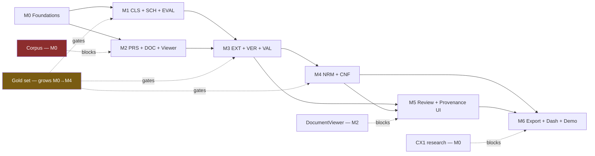

# Phase 11 — Project Management

> **Constraint:** 4 weeks · 3 developers · AI-assisted.
> **Governing rule:** every milestone ends with `main` runnable, demoable, and tagged.
> A milestone that leaves the system broken has not been completed, regardless of code written.

---

## 1. Milestone overview

| M | Days | Theme | Ends with a system that… | Tag |
|---|---|---|---|---|
| **M0** | 1–3 | Foundations, corpus, gold set v1 | Ingests a CSV, persists it, shows records in a UI. Corpus fetched. 150 labels done. | `m0` |
| **M1** | 4–6 | Classification, schema, **eval harness** | Classifies with abstention against a real schema, scored in CI. | `m1` |
| **M2** | 7–10 | Parsing, document binding, **DocumentViewer** | Binds an MPN to the right document *and row*, and shows you the page. | `m2` |
| **M3** | 11–14 | Extraction, verification, validation | **First end-to-end enrichment** with evidence and abstention. | `m3` |
| **M4** | 15–17 | Normalisation, confidence, calibration | Canonical units, calibrated scores, the frontier chart. | `m4` |
| **M5** | 18–21 | Review queue, provenance UI, explainability | A human works the queue faster than by hand. **The product exists.** | `m5` |
| **M6** | 22–28 | Export, dashboard, hardening, demo | Judge Mode, metrics, polish, rehearsed demo, submission. | `m6` |

**Three parallelisable workstreams run throughout** — pipeline/domain, interface, and
data/evaluation. They converge at each milestone gate. Ownership of module directories should be
agreed at the M0 kickoff to minimise merge contention (risk F2).

---

## 2. Milestones in detail

### M0 — Foundations · Days 1–3

**Goal:** a running skeleton with every architectural guarantee already enforced, and the data
acquisition started. Nothing intelligent happens yet, and that is correct.

**Deliverables**
- Repo, `docker-compose.yml`, `Makefile`, CI skeleton, `.env.example`
- Postgres schema migration #1 **including every INV `CHECK` constraint**
- `resources/` loading: taxonomy, attributes, rules, units, abbreviations (5 PVF classes, hand-authored)
- Idempotent seeder
- `tests/architecture/` — layering, INV-1, INV-6, no-`eval`, no-hard-delete
- `llm_call` ledger table + cost accounting scaffolding
- `BlobStore` port with local FS **and** S3 adapters
- `LLMProvider` port with real, `cached` (replay), and `offline` adapters
- ING module: CSV import with column mapping, per-row error reporting
- Frontend shell: nav, `/catalog` list, `/catalog/:id` stub
- **Corpus fetch scripts + `corpus/manifest.json`; 150+ documents downloaded**
- **Gold set v1: 150 labelled attribute values**
- Decision on CX1 integration research (findings written into `api.md` and ADR-0010)

**Files expected:** `backend/src/openspec/{domain/model,application/ports,infrastructure/{db,blob,llm},api}`, `resources/**`, `tests/architecture/**`, `frontend/app/{catalog}`, `corpus/**`, `evaluation/gold/**`

**Verification checklist**
- [ ] Clean clone → `make up` → app reachable in ≤15 min
- [ ] Architecture tests pass and **demonstrably fail** when a violation is introduced deliberately
- [ ] Integration test proves the DB rejects an `ACCEPTED` Tier-0 row
- [ ] Seeder is idempotent (run twice, identical state)
- [ ] 500-row CSV imports with a per-row error report
- [ ] `cached` LLM adapter replays a recorded response
- [ ] 150 gold labels committed and reviewed

**Effort:** ~9 developer-days · **Demo checkpoint:** "here is the skeleton, and here is the database
refusing to accept a pressure rating without human approval." **Stop point:** tag `m0`.

---

### M1 — Classification, Schema, Evaluation · Days 4–6

**Goal:** the system knows what a product *is* and what attributes it *should* have — and we can
measure how well.

**Deliverables**
- CLS: deterministic abbreviation/regex pre-pass; LLM residual classifier; abstention
- SCH: schema resolution, mandatory sets, completeness computation
- **EVL: full evaluation harness** — scoring, metrics, Wilson CIs, Markdown + JSON report
- CI eval gate wired (conditional on pipeline file changes)
- Classification confidence + provenance (`rule` / `llm`)
- Frontend: class + completeness on the record detail page; reclassify action
- Gold set → 300 labels; difficulty tags applied

**Verification checklist**
- [ ] Deterministic pre-pass alone resolves ≥40% of records at ≥99% precision
- [ ] Classification top-1 ≥95% with ≤5% abstention on the gold set
- [ ] `make eval` produces a report with confidence intervals
- [ ] A deliberately introduced regression fails CI
- [ ] Real and synthetic slices reported separately

**Effort:** ~9 dev-days · **Demo checkpoint:** "40% of classification needs no AI at all — and here
is the measured proof." **Stop point:** tag `m1`.

> ⚠ **M1 is the milestone teams skip.** Building the eval harness before the extractor feels like
> building a scoreboard before the team. It is the opposite: without it, every subsequent decision
> for three weeks is made blind.

---

### M2 — Parsing, Binding, DocumentViewer · Days 7–10

**Goal:** find the right document, find the right row, and *show* it. This is the milestone that
retires the highest-variance risk in the project.

**Deliverables**
- PRS: text + table extraction with page/bbox; region tree with stable paths; parse artifact caching by content hash; OCR fallback; `DOCUMENT_UNPARSEABLE` handling
- Server-side page rasterisation to cached images
- DOC: retrieval hierarchy (exact → normalised → supplier → class → overlap → LLM disambiguation), signal capture, document + **row-level binding confidence**, conflict detection, manual attach/detach
- **`DocumentViewer` component** — page render, span highlight, region overlay, navigation
- Frontend: `/documents` corpus browser; binding shown on record detail
- Gold set → 450 labels including ≥60 family-table cases; adversarial wrong-document slice built

**Verification checklist**
- [ ] Binding accuracy ≥95% on the gold set
- [ ] Adversarial wrong-document rejection ≥90%
- [ ] A family datasheet resolves to the correct table **row**, visibly highlighted
- [ ] Parse cache hit ratio >95% on a same-document batch
- [ ] Highlight coordinates verified by a visual regression test
- [ ] Unparseable documents produce a reason code, never a crash

**Effort:** ~12 dev-days · **Demo checkpoint:** **the money shot** — paste an MPN, watch it bind to
row 14 of a 40-row table, highlighted on the page. **Stop point:** tag `m2`.

---

### M3 — Extraction, Verification, Validation · Days 11–14

**Goal:** first true end-to-end enrichment, with evidence, verification, and abstention.

**Deliverables**
- EXT: region-scoped grounded extraction, structured output, mandatory verbatim spans, multi-candidate ranking, rules-based inference from thin descriptions
- INV-3 deterministic span containment check
- VER: independent verifier (different model, asymmetric adversarial prompt), verdict + rationale
- VAL: declarative rules engine (restricted DSL), ≥60 rules across 5 classes, cross-field constraints
- Full `Unknown` reason-code taxonomy wired end-to-end
- PRV: evidence, verification, transform records persisted; audit events
- **Adversarial suite: prompt injection corpus + `domain_knowledge_bait` slice in CI**
- Frontend: attributes with values, evidence highlight linkage, `Unknown` with reasons

**Verification checklist**
- [ ] 100% of emitted values have valid evidence (INV-1/INV-3 assertions green)
- [ ] Verification measurably reduces error rate vs extraction-only — **delta recorded**
- [ ] Prompt injection resistance ≥98%
- [ ] `domain_knowledge_bait` correct abstention ≥90%
- [ ] Every `Unknown` carries a reason code from the closed set
- [ ] End-to-end: CSV in → enriched attributes with provenance out

**Effort:** ~12 dev-days · **Demo checkpoint:** the abstention beat — a value proposed, independently
rejected, and shown as `Unknown` with the verifier's reason. **Stop point:** tag `m3`.

> 💡 **Measure QR-1…QR-15 here for the first time and publish the numbers internally.** If they
> disagree with the targets, re-baseline now with reasons — not in week 4.

---

### M4 — Normalisation, Confidence, Calibration · Days 15–17

**Goal:** values become canonical, and the confidence number starts meaning something.

**Deliverables**
- NRM: fraction parsing, unit conversion (exact rationals), NPS/DN designations, pressure media handling, **Class ⇎ WOG non-derivation rule**, end-connection synonyms, transform chain recording
- CNF: composite signal scoring; **calibration fitted on the gold set**; reliability diagram; tier routing policy; INV-9 enforcement in the routing layer
- **Frontier chart + calibration diagram generated by the eval harness**
- **Ablation study run #1** (5 configurations)
- Performance pass: batch throughput, parse caching, prompt caching, cost measurement
- Frontend: `/evaluation` page with frontier, reliability, slice table
- Gold set → 550 labels; unit-trap slice completed

**Verification checklist**
- [ ] 100% branch coverage on `nrm/`; property tests green (idempotence, round-trip, no float drift)
- [ ] NPS is never unit-converted; Class ⇎ WOG refuses with an explanation
- [ ] ECE ≤0.05; reliability diagram produced
- [ ] Frontier chart generated automatically from a real run
- [ ] Ablation table populated with measured numbers
- [ ] Cost/SKU measured and displayed; ≤$0.12 target checked
- [ ] Batch throughput ≥400 SKU/hr single worker

**Effort:** ~9 dev-days · **Demo checkpoint:** the frontier chart, with the "generic LLM, no
abstention" point plotted beside it. **Stop point:** tag `m4`.

---

### M5 — Review Queue, Provenance UI, Explainability · Days 18–21

**Goal:** the product becomes usable by a human, and the throughput claim becomes measurable.

**Deliverables**
- RVW: task generation by reason code, queue filtering, accept/reject/correct/reclassify/reattach, bulk actions, approver flow for Tier 0, session resumption
- **Full keyboard operation** + shortcut overlay
- **"Why?" panel** — evidence, verification, validation, normalisation chain, confidence signals, policy
- Human corrections → supersession + `HUMAN` provenance + eval feedback store
- Throughput meter (attributes/hour vs configurable manual baseline)
- **Timed head-to-head throughput experiment, recorded** (AC-RVW)
- Audit timeline on record detail
- Accessibility pass: axe clean, keyboard audit, contrast, no colour-only encoding
- **DR drill**: wipe, restore from snapshot, verify

**Verification checklist**
- [ ] Reviewer resolves ≥5× the manual baseline — **measured, with the experiment recorded**
- [ ] Every action reachable without a mouse
- [ ] Corrections supersede correctly; audit trail complete
- [ ] Tier-0 cannot be accepted by a `reviewer` role (verified via direct API call, not just UI)
- [ ] Axe reports zero violations; both themes pass contrast
- [ ] Snapshot restore verified on a wiped environment

**Effort:** ~12 dev-days · **Demo checkpoint:** the reviewer working the queue at speed, throughput
meter climbing against the baseline. **Stop point:** tag `m5`.

---

### M6 — Export, Dashboard, Hardening, Demo · Days 22–28

**Goal:** close the loop to a deployable artifact, and make the story land.

**Deliverables**
- PUB: CSV/XLSX/JSON export with provenance columns; **CX1 adapter**; policy filters; REST pull API; CSV formula-injection guard
- DSH: catalog health, STP, cost/SKU vs manual baseline, `Unknown` reason breakdown, quality trend, run monitor
- **Judge Mode** with stage narration, ad-hoc PDF upload, hard timeout, isolation
- Cloud deployment (timeboxed to 1 day)
- Security hardening pass: rate limits, headers, dependency audit, sandbox verification
- Ablation study run #2 (final numbers)
- Performance test suite run and recorded
- **Demo snapshot + `cached` recording + backup laptop + fallback video**
- Pitch deck, 3-minute video, rehearsed Q&A
- Documentation final pass; ADRs complete

**Verification checklist**
- [ ] Export validates against the target schema with zero errors
- [ ] Dashboard numbers reconcile with the database
- [ ] Judge Mode survives three unrehearsed inputs and one hostile input
- [ ] All QR targets measured and reported (real slice first)
- [ ] Full manual QA checklist passed
- [ ] Demo validation checklist passed on the backup machine
- [ ] Demo rehearsed ≥3 times within the time limit with 20% margin

**Effort:** ~18 dev-days · **Demo checkpoint:** the full run. **Stop point:** tag `m6`, freeze
`release/demo`, submit.

---

## 3. Dependency graph

**Critical path:** `Corpus (M0) → PRS/DOC (M2) → EXT/VER (M3) → CNF (M4) → Review (M5) → Demo (M6)`.
**Corpus acquisition and gold-set labelling are on the critical path from day one** and are the most
commonly under-resourced items in a project of this shape.

---

## 4. Risk register (consolidated)

| # | Risk | P | I | Score | Mitigation | Trigger to escalate |
|---|---|---|---|---|---|---|
| R1 | Demo assumes the document is already in hand | M | H | 🔴 | DOC is a first-class module (M2) | — retired at M2 |
| R2 | Citation ≠ correctness attacked live | M | H | 🔴 | VER + INV-3 + rehearsed answer | — |
| R4 | No labelled eval set | M | H | 🔴 | Gold set gates M1/M3/M4 | <300 labels by day 6 |
| R5 | Fake confidence scores | M | H | 🔴 | Composite signals + calibration (M4) | ECE >0.10 at M4 |
| R11 | A1 wrong (not Unilog's hackathon) | L | M | 🟡 | Positioning-only change | Confirm week 1 |
| R13 | CX1 schema guessed then invalidated | M | M | 🟠 | Adapter interface; research in M0 | No CX1 info by day 5 |
| R14 | Synthetic-only eval inflates numbers | M | H | 🔴 | Real held-out slice, reported first | <100 real labels by M3 |
| R15 | Demo depends on a live third-party fetch | L | H | 🟠 | Local corpus mandatory (FR-DOC-8) | — |
| R17 | 16 Track-A capabilities → week-4 integration debt | M | H | 🔴 | Runnable-at-every-milestone rule; M6 hardening budget | Any milestone ends red |
| R22 | QR targets unachievable on real data | M | M | 🟠 | Measure at M3, re-baseline publicly | Precision <95% at M3 |
| E1 | Highlight coordinate misalignment | M | M | 🟠 | Server-side rasterisation + visual regression | — |
| E2 | DocumentViewer slips, blocking 3 pages | M | H | 🔴 | Scheduled M2, ahead of dependents | Not started by day 8 |
| F2 | Merge conflict churn (3 AI-assisted devs) | H | M | 🟠 | Module ownership, ≤2-day branches | >2 painful conflicts/day |
| G1 | Injection defence asserted, never measured | M | M | 🟠 | Adversarial slice gates M3 | — |
| H1 | Eval harness slips past M1 | M | H | 🔴 | M1 gate item | Not started by day 4 |
| N1 | Scope creep from "one more feature" | H | M | 🟠 | Track A list is frozen after M0; additions require a removal | Any un-listed feature in a PR |
| N2 | Demo rehearsal left to the final night | M | H | 🔴 | Daily from day 24 | — |

**Escalation rule:** any 🔴 whose trigger fires stops feature work until it is addressed. That rule
only works if it is agreed at M0, before anyone is emotionally invested in a feature.

---

## 5. Definition of Ready / Done

**Ready** — has a requirement ID · acceptance criteria written · verification method chosen ·
dependencies available · fits inside one milestone · no unresolved design question.

**Done** — implemented · unit + integration tested · eval slice passing (if pipeline-touching) ·
architecture tests green · documented in `/docs` · demoable on `main` · no new lint/type/security
findings · PR reviewed and squashed.

**Milestone Done** — all of the above for every deliverable · verification checklist fully ticked ·
manual QA checklist passed · `main` tagged · demo checkpoint performed for the team.

---

## 6. Technical debt register (accepted deliberately)

| # | Debt | Why accepted | Repayment trigger |
|---|---|---|---|
| TD-1 | Single-tenant deployment despite multi-tenant schema | No second customer | 2nd tenant |
| TD-2 | Postgres queue rather than a broker | Sufficient at this scale | >10k sustained queue depth |
| TD-3 | No antivirus on uploads | Time; documented gap | Commercial launch |
| TD-4 | Hand-authored taxonomy rather than ETIM | Licensing unresolved | ETIM licence obtained |
| TD-5 | Session auth rather than SSO | Zero demo value | Enterprise pilot |
| TD-6 | Manual baseline is measured on our own team, not a professional analyst | No access | Customer pilot |
| TD-7 | No vector search | Corpus too small to need it | >100k documents |
| TD-8 | Alerting is a webhook, not an on-call system | 4-week build | Production SLA |

**Every item here is a deliberate, justified decision with a repayment trigger.** Presenting this
register to judges is a strength: it demonstrates that the gaps are known and chosen, not missed.

---

## 7. Future roadmap (post-hackathon)

| Horizon | Items |
|---|---|
| **Next 3 months** | ETIM licensing + mapping · live PIM/ERP connectors · SSO · supplier document portal ingestion · self-hosted model option |
| **6 months** | Cross-reference/interchange · obsolescence + lifecycle tracking · image and CAD extraction · multi-language · manufacturer certification portal (second market) |
| **12 months** | Fine-tuned domain models trained on accumulated reviewer corrections · SOC 2 Type II · marketplace channel adapters · data-quality benchmarking as a product |

---

## ✔ Summary

- **Seven milestones over four weeks**, each leaving `main` runnable, tagged, and demoable.
- The **eval harness lands at M1**, before the extractor — the sequencing decision that most
  determines whether the final numbers are real.
- **M2 retires the highest-variance risk** (document binding) and delivers the demo's money shot.
- **M3 is the first honest measurement point**; targets get re-baselined there if reality disagrees,
  publicly and with reasons — never silently in week 4.
- Corpus acquisition and gold-set labelling are **on the critical path from day one**, which is where
  projects of this shape usually fail.
- A technical debt register with repayment triggers turns known gaps from weaknesses into evidence
  of engineering judgement.

## ⚠ Risks

Consolidated in §4. The three that would most likely sink the project: **eval harness slipping past
M1** (quality becomes unmeasurable), **gold set under-resourced** (every claim becomes an assertion),
and **week-4 integration debt** from building broadly instead of vertically.

## 💡 Recommendations

1. **Freeze the Track A list after M0.** Any addition requires an explicit removal. Write this down
   and agree it before anyone is attached to a feature.
2. **Start corpus + labelling on day 1**, in parallel with the skeleton. It is unglamorous, it is on
   the critical path, and it cannot be compressed later.
3. **Hold the milestone gates honestly.** A milestone that "mostly" passes its checklist has not
   passed; carrying half-done work forward is how the last week becomes unrecoverable.
4. Re-baseline QR targets publicly at M3 if measurement disagrees. Reporting a lower real number with
   reasons is a credibility gain; discovering it on demo day is a loss.
