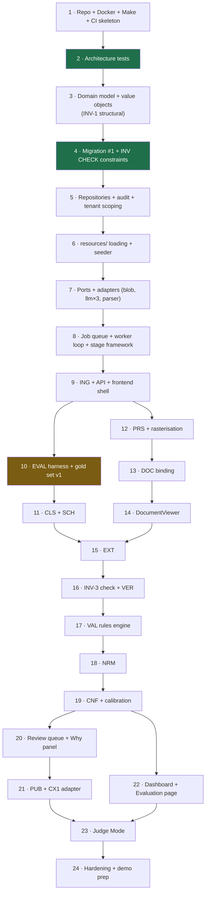

# Phase 14 — Implementation Blueprint

> **Audience:** whoever (human or agent) is about to write code.
> **Read this first, then the milestone section in `10-roadmap.md`, then the relevant module doc.**
> **Do not skip the order below.** It is sequenced so that every guarantee exists before the code it
> is meant to guard.

---

## 1. The ordering principle

Three rules determine the entire build order:

1. **Guards before the guarded.** Architecture tests and database constraints exist *before* the code
   they constrain. Retrofitting an invariant onto violating code is a negotiation; writing it first
   is a fact.
2. **Measurement before optimisation.** The evaluation harness exists before the extractor. Otherwise
   three weeks of tuning happen blind.
3. **Vertical slices, never horizontal layers.** Never "build all the backend, then all the
   frontend." Every milestone delivers a thin working path through every layer, because a system
   that has never run end-to-end has unknown integration cost — and that cost always lands in week 4.

---

## 2. Dependency graph (build order)



---

## 3. File & folder creation order

**Step 1 — Repo skeleton**
`README.md` · `CLAUDE.md` · `Makefile` · `docker-compose.yml` · `.env.example` · `.github/workflows/ci.yml` · `backend/pyproject.toml` · `frontend/package.json` · `.gitignore` · `.pre-commit-config.yaml`

**Step 2 — Guards (before any feature code)**
`backend/tests/architecture/{test_layering,test_determinism,test_evidence_required,test_no_eval,test_no_hard_delete,test_tenant_scoping}.py`

**Step 3 — Domain model**
`domain/model/{record,attribute,document,confidence,states}.py` · `domain/errors.py`
→ Includes the `AttributeValue` factory methods that make INV-1 structural, and the value objects
(`Mpn`, `NominalSize`, `PressureRating`, `Quantity`) that make unit bugs unrepresentable.

**Step 4 — Persistence**
`alembic/versions/0001_initial.py` (**all INV `CHECK` constraints here**) · `infrastructure/db/{models,session,unit_of_work}.py` · `infrastructure/db/repositories/*.py`
→ Immediately: `tests/integration/test_constraints.py` proving each constraint rejects violations.

**Step 5 — Configuration & seed**
`resources/{taxonomy,rules,units,abbreviations,prompts}/**` · `config/settings.py` · `scripts/seed.py`

**Step 6 — Ports & adapters**
`application/ports/*.py` · `infrastructure/blob/{local,s3}.py` · `infrastructure/llm/{anthropic,cached,offline}.py` · `infrastructure/parsing/*.py` · `infrastructure/fetch/policy_guard.py` · `infrastructure/observability/{logging,tracing,llm_ledger}.py`

**Step 7 — Pipeline framework**
`infrastructure/queue/postgres_queue.py` · `worker/main.py` · `application/stages/base.py` · `application/usecases/enrich_record.py`

**Step 8 — First vertical slice (ING)**
`application/stages/ing.py` · `api/routers/records.py` · `api/schemas/records.py` · `api/deps.py` · `frontend/app/{layout,page}.tsx` · `frontend/app/catalog/**` · `frontend/lib/api-client.ts`
→ **Checkpoint: `make up` → import a CSV → see records. Tag `m0`.**

**Step 9 — Evaluation** *(before the extractor — this ordering is deliberate)*
`evaluation/gold/*.yaml` · `application/usecases/run_evaluation.py` · `infrastructure/eval/{scorer,metrics,report,charts}.py` · `.github/workflows/eval.yml`

**Step 10 — CLS + SCH** → `domain/cls/rules.py` · `application/stages/{cls,sch}.py` · `resources/prompts/cls_v1.md` → **Tag `m1`.**

**Step 11 — PRS + DOC + Viewer** → `application/stages/{prs,doc}.py` · `infrastructure/parsing/{pdfplumber_parser,ocr_fallback,rasteriser}.py` · `domain/doc/binding_signals.py` · `frontend/components/DocumentViewer/**` → **Tag `m2`.**

**Step 12 — EXT + VER + VAL** → `application/stages/{ext,ver}.py` · `domain/val/{engine,rules_dsl,crossfield}.py` · `resources/prompts/{ext_v1,ver_v1}.md` · `resources/rules/*.yaml` · `tests/adversarial/**` → **Tag `m3`.**

**Step 13 — NRM + CNF** → `domain/nrm/{fractions,units,nominal_size,pressure,connections,pipeline}.py` · `domain/cnf/{scoring,calibration,routing}.py` · `frontend/app/evaluation/**` → **Tag `m4`.**

**Step 14 — Review + Explainability** → `application/usecases/review_decision.py` · `api/routers/review.py` · `frontend/app/review/**` · `frontend/components/WhyPanel/**` → **Tag `m5`.**

**Step 15 — Publish + Dashboard + Judge Mode + hardening** → `infrastructure/export/{csv,json,cx1}.py` · `api/routers/{export,judge,eval}.py` · `frontend/app/{judge,page}/**` · `scripts/{snapshot,restore,record_llm_cache}.sh` → **Tag `m6`.**

---

## 4. Development checklist (per unit of work)

- [ ] Requirement ID identified (`FR-…` / `NFR-…` / `INV-…`)
- [ ] Correct layer chosen; the dependency rule respected
- [ ] Domain logic is pure — no I/O, no clock, no randomness
- [ ] New behaviour has unit tests; new rules have a passing **and** a failing case
- [ ] Invariants preserved; if a new one emerged, it has a test
- [ ] Prompt changes are versioned files with a version bump
- [ ] Errors classified (domain abstention / transient / contract violation)
- [ ] Structured logging with correlation ID; no document content or secrets logged
- [ ] Docs updated in the same PR (`api.md` **before** an endpoint change)
- [ ] Eval harness run if the pipeline was touched
- [ ] PR < ~400 lines; conventional commit

---

## 5. Risk checklist (before each milestone gate)

- [ ] Does `main` still run from a clean clone in ≤15 min?
- [ ] Do the architecture tests still pass — **and still fail when violated?**
- [ ] Are all constraint-rejection tests green?
- [ ] Has the eval harness run, and did any metric regress?
- [ ] Is the gold set at its milestone target size?
- [ ] Is the demo snapshot current and restorable?
- [ ] Has anything been added that isn't on the frozen Track A list?
- [ ] Are any 🔴 risk triggers from `10-roadmap.md` §4 firing?

---

## 6. Testing checkpoints

| After step | Must be true |
|---|---|
| 2 | Architecture tests fail on a deliberately introduced violation |
| 4 | Each INV constraint provably rejects an invalid insert |
| 7 | A worker crash mid-stage loses ≤1 stage; the job is reclaimed |
| 8 | E2E: CSV → records visible in the UI |
| 9 | `make eval` produces a report with confidence intervals |
| 11 | Family-datasheet row binding verified visually and by regression test |
| 12 | Injection ≥98%; `domain_knowledge_bait` abstention ≥90%; verification delta measured |
| 13 | 100% branch on `nrm/`; ECE ≤0.05; frontier chart auto-generated |
| 14 | Keyboard-only review of 3 tasks; throughput measured |
| 15 | Export validates; Judge Mode survives hostile input; full demo checklist passes |

---

## 7. Deployment checklist

- [ ] Migrations applied forward-only; additive-first verified
- [ ] `Settings` fails fast on missing values
- [ ] Secrets from the platform store; none in the repo (`gitleaks` clean)
- [ ] Non-root containers; healthchecks responding
- [ ] Rate limits and security headers enabled
- [ ] Dependency audit clean of criticals
- [ ] `/health` and `/ready` verified
- [ ] Rollback path tested (redeploy previous tag)
- [ ] Demo snapshot taken **after** deployment and verified

---

## 8. Context reset points (for AI-assisted sessions)

Long agent sessions accumulate stale context and drift. These are natural boundaries at which to
start a fresh session with a clean brief:

| Reset at | Fresh session should load |
|---|---|
| Each milestone boundary | `CLAUDE.md` + `10-roadmap.md` milestone section |
| Switching module (e.g. `NRM` → `RVW`) | `CLAUDE.md` + that module's doc section |
| Switching layer (backend → frontend) | `CLAUDE.md` + `06-frontend.md` + `api.md` |
| Starting the eval/gold-set work | `CLAUDE.md` + `03-ai-pipeline.md` §8 + `09-testing.md` |
| Debugging a specific failure | `CLAUDE.md` + the failing test + the relevant module doc only |
| After any large refactor | Fresh session — old context describes code that no longer exists |

**Brief template for a fresh session:**

```
Milestone: M<n> — <theme>
Task: <requirement ID> — <one line>
Read: CLAUDE.md, docs/<relevant>.md
Constraints: respect INV-1..INV-10; domain layer stays pure; update docs in this PR
Definition of done: <verification checklist items>
```

> 💡 **A stale agent session is the AI-assisted equivalent of a merge conflict** — it produces
> confident work against a world that has changed. Resetting at module boundaries costs a minute of
> re-briefing and saves hours of subtly-wrong code.

---

## ✔ Summary

- Build order follows three rules: **guards before the guarded**, **measurement before
  optimisation**, **vertical slices never horizontal layers**.
- Architecture tests and database constraints are steps 2 and 4 — before any feature code exists.
- The evaluation harness is step 9, **before the extractor** at step 15.
- Every milestone ends with a runnable, tagged system; the checklist for each gate is explicit.
- Context reset points are defined so AI-assisted sessions don't drift into confident wrongness.

## ⚠ Risks

| # | Risk | Mitigation |
|---|---|---|
| K1 | Order abandoned under pressure ("we'll add the tests after") | The gates are milestone criteria, not suggestions |
| K2 | Horizontal building creeps in | Every milestone's demo checkpoint requires an end-to-end path |
| K3 | Agent sessions run long and drift | Reset points in §8; re-brief at every module boundary |
| K4 | Steps 2 and 4 feel like overhead on day 1 | They are ~6 hours total and they protect 20 days |

## 💡 Recommendations

1. **Do steps 1–4 before writing a single feature.** Roughly one day, and it makes every guarantee in
   this project real rather than aspirational.
2. Tag every milestone. Bisecting to a known-good state in week 4 is worth more than any debugging.
3. Use the fresh-session brief template. It is thirty seconds of typing and it is the single most
   effective way to keep AI-assisted output aligned with the architecture.
